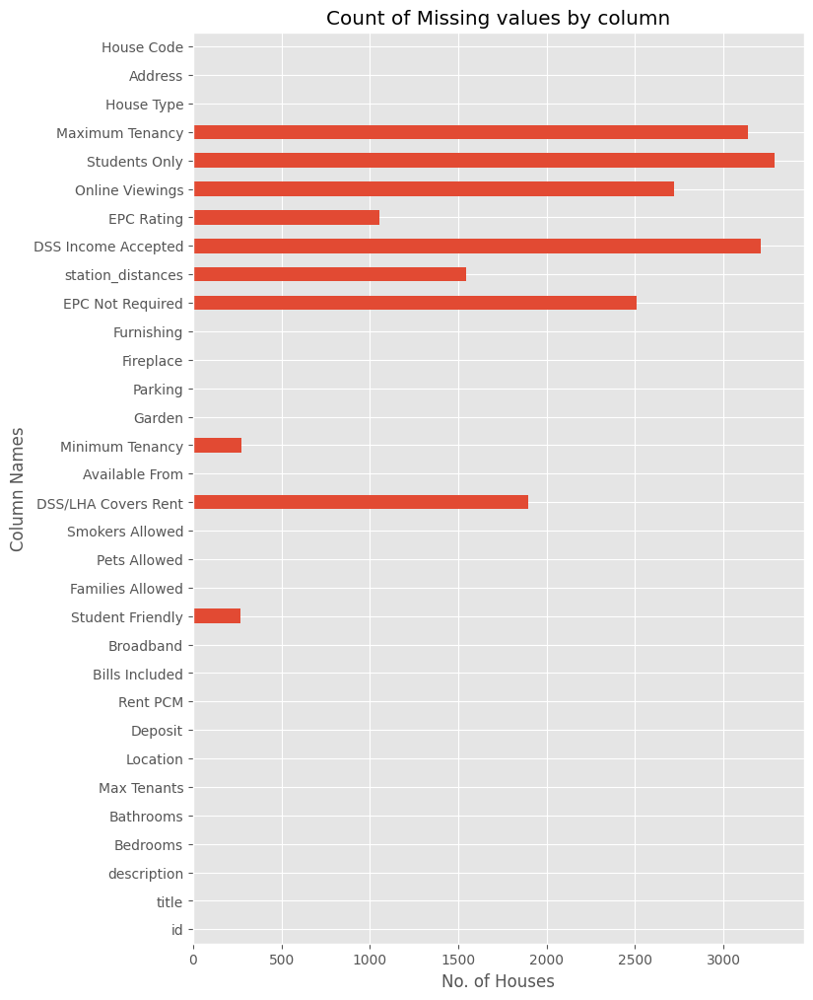
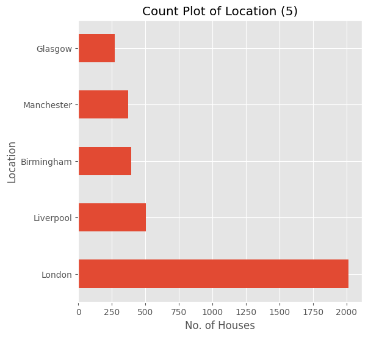
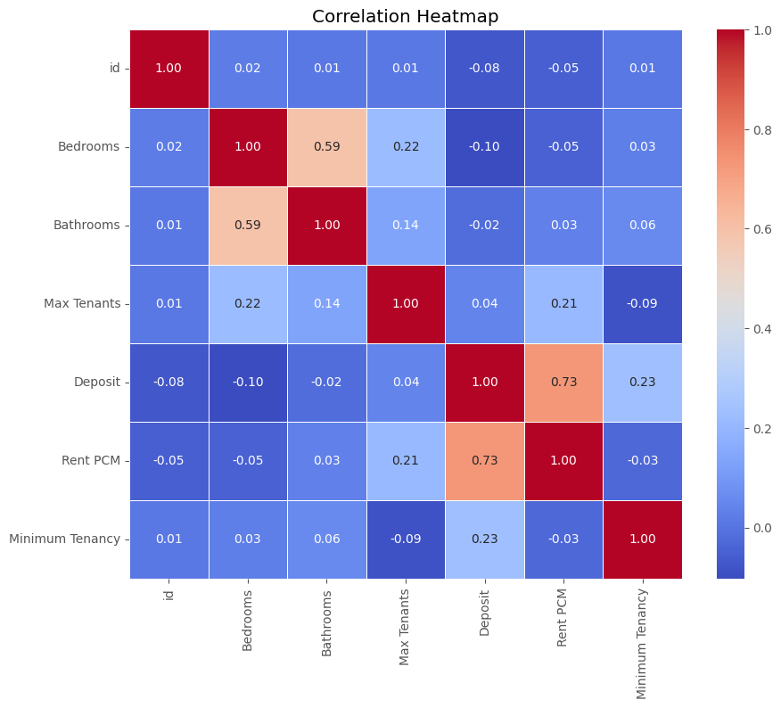
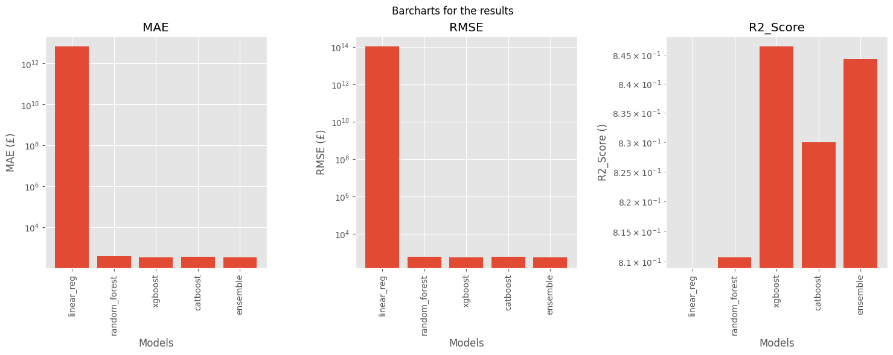
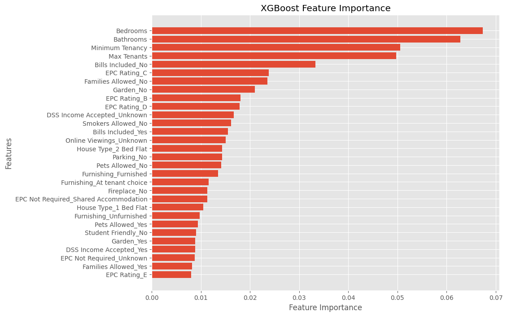
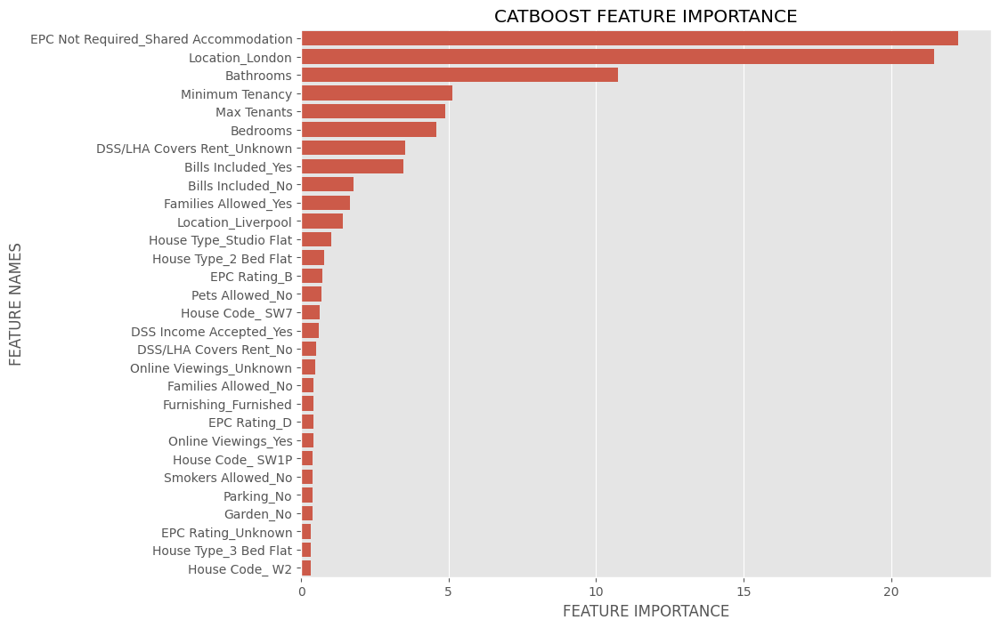

In the first part, we scraped property data from 5 UK cities and processed the images corresponding to each of the properties. Now we implement a Machine Learning workflow to identify the best model to predict house prices based on the information we have.

The notebook begins by importing the necessary libraries to facilitate the entire machine-learning workflow

```python
import pandas as pd  # Importing pandas library and aliasing it as pd
import numpy as np  # Importing numpy library and aliasing it as np
from matplotlib import pyplot as plt  # Importing pyplot module from matplotlib library and aliasing it as plt
import os  # Importing os module for operating system dependent functionality
import seaborn as sns  # Importing seaborn library and aliasing it as sns
import warnings
warnings.filterwarnings('ignore')
pd.set_option('display.max_columns', None)   # Setting pandas option to display all columns in DataFrame
plt.style.use('ggplot')  # Setting plot style to 'ggplot' from matplotlib
```
Next, we read in the relevant datasets.

```python
london_df = pd.read_csv('Openrent London.csv')  # Reading data from 'Openrent London.csv' into london_df DataFrame
birmingham_df = pd.read_csv('Openrent Birmingham.csv')  # Reading data from 'Openrent Birmingham.csv' into birmingham_df DataFrame
liverpool_df = pd.read_csv('Openrent Liverpool.csv')  # Reading data from 'Openrent Liverpool.csv' into liverpool_df DataFrame
glasgow_df = pd.read_csv('Openrent Glasgow.csv')  # Reading data from 'Openrent Glasgow.csv' into glasgow_df DataFrame
manchester_df = pd.read_csv('Openrent Manchester.csv')  # Reading data from 'Openrent Manchester.csv' into manchester_df DataFrame
```
Then, all 5 are concatenated into one dataset.
```python
# Setting the 'Location' column for each DataFrame to its respective city name
london_df['Location'] = 'London'
birmingham_df['Location'] = 'Birmingham'
liverpool_df['Location'] = 'Liverpool'
glasgow_df['Location'] = 'Glasgow'
manchester_df['Location'] = 'Manchester'

# Concatenating london_df, birmingham_df, liverpool_df, glasgow_df, and manchester_df DataFrames into one DataFrame
# Resetting the index to avoid duplicate indices
all_df = pd.concat([london_df, birmingham_df, liverpool_df, glasgow_df, manchester_df]).reset_index(drop=True)

# Displaying the concatenated DataFrame
all_df.head()
```
|   | id      | title                                      | description       | Bedrooms | Bathrooms | Max Tenants | Location | Deposit   | Rent PCM  | Bills Included | Broadband   | Student Friendly | Families Allowed | Pets Allowed | Smokers Allowed | DSS/LHA Covers Rent | Available From | Minimum Tenancy | Garden | Parking | Fireplace | Furnishing | EPC Not Required     | station_distances                                 | DSS Income Accepted | EPC Rating | Online Viewings | Students Only | Maximum Tenancy | DSS/LHA Covers Rent | Online Viewings | DSS Income Accepted |
|---|---------|--------------------------------------------|-------------------|----------|-----------|-------------|----------|-----------|-----------|----------------|-------------|------------------|------------------|--------------|-----------------|---------------------|----------------|-----------------|--------|---------|-----------|------------|----------------------|---------------------------------------------------|---------------------|------------|-----------------|---------------|-----------------|---------------------|-----------------|---------------------|
| 0 | 1993394 | Room in a Shared Flat, London, E3          | Lovely rooms a... | 3        | 1         | 3           | London   | £1,000.00 | £1,000.00 | Yes            | View Offers | Yes              | Yes              | Yes          | Yes             | No                  | Today          | 1 Months        | No     | No      | No        | Furnished  | Shared Accommodation | [['Charing Cross', '2 minute walk'], ['London ... | NaN                 | NaN        | NaN             | NaN           | NaN             | NaN                 | NaN             | NaN                 |
| 1 | 1999634 | Room in a Shared House, Brimsdownhouse, E3 | Single-double ... | 4        | 1         | 99          | London   | £1,000.00 | £1,000.00 | No             | View Offers | Yes              | Yes              | Yes          | Yes             | NaN                 | Today          | 1 Months        | No     | No      | No        | Furnished  | Shared Accommodation | [['Charing Cross', '2 minute walk'], ['London ... | Yes                 | NaN        | NaN             | NaN           | NaN             | NaN                 | NaN             | NaN                 |
| 2 | 2004817 | Room in a Shared Flat, London, E3          | Lovely rooms a... | 3        | 1         | 3           | London   | £1,000.00 | £1,000.00 | Yes            | View Offers | Yes              | Yes              | Yes          | Yes             | No                  | Today          | 1 Months        | No     | No      | No        | Furnished  | Shared Accommodation | [['Charing Cross', '2 minute walk'], ['London ... | NaN                 | NaN        | NaN             | NaN           | NaN             | NaN                 | NaN             | NaN                 |
| 3 | 2009862 | Studio Flat, Craven Street, WC2N           | We are proud t... | 1        | 1         | 2           | London   | £3,919.99 | £3,397.33 | Yes            | View Offers | Yes              | No               | No           | Yes             | No                  | Today          | 6 Months        | No     | No      | No        | Furnished  | NaN                  | [['Charing Cross', '2 minute walk'], ['London ... | NaN                 | C          | NaN             | NaN           | NaN             | NaN                 | NaN             | NaN                 |
| 4 | 2014131 | 1 Bed Flat, Craven Street, WC2N            | **BILLS INCLUD... | 1        | 1         | 2           | London   | £3,460.00 | £2,998.67 | Yes            | View Offers | Yes              | No               | No           | No              | No                  | Today          | 3 Months        | No     | No      | No        | Furnished  | NaN                  | [['Charing Cross', '2 minute walk'], ['London ... | NaN                 | C          | NaN             | NaN           | NaN             | NaN                 | NaN             | NaN                 |

Where the number of unique rows is:
```python
print(f"Number of Unique House IDS: {all_df['id'].nunique()}")
```
`` Number of Unique House IDS: 3560``

Now, to tidy up the dataframe.

## Data Cleaning
We focus on cleaning specific columns per time.

### Whitespace Removal  in Column Names and Deduplication
It was that noticed some column names have extra spaces (e.g., "Online Viewings ", "DSS Income Accepted "). These spaces can cause problems during data preprocessing. To avoid these issues, extra spaces were removed from these column names. Duplicate columns were also dropped for good measure.
```python
all_df.columns = [col.strip() for col in all_df.columns]

# Drop duplicate columns
all_df = all_df.loc[:,~all_df.columns.duplicated()]
all_df
```

### Cleaning the "Rent PCM" and "Deposit" Columns
The notebook cleans the "Rent PCM" and "Deposit" columns by:

1.  Removing pound signs (£) and commas using pandas' `replace` method.
2.  Converting the columns to numerical (float) data type using `astype`.

This ensures the rent and deposit values are usable for analysis and modeling.


```python
# Removing pound sign (£) and commas from 'Rent PCM' and 'Deposit' columns

all_df['Rent PCM'] = all_df['Rent PCM'].str.replace('£', '').str.replace(',', '')  # Removing pound sign and commas from 'Rent PCM' column
all_df['Deposit'] = all_df['Deposit'].str.replace('£', '').str.replace(',', '')  # Removing pound sign and commas from 'Deposit' column

# Converting the rent values to integers

all_df['Rent PCM'] = all_df['Rent PCM'].astype(float)  # Converting 'Rent PCM' column values to float type
all_df['Deposit'] = all_df['Deposit'].astype(float)  # Converting 'Deposit' column values to float type
```
### Cleaning the "Minimum Tenancy" Column
The notebook cleans the "Minimum Tenancy" column by:

1.  Removing "Months" and extra spaces using string manipulation.
2.  Converting the column to numerical (float) format using `astype`.

This ensures the values are usable for calculations.

```python
# Removing 'Months' and extra spaces from 'Minimum Tenancy' column and converting values to float
all_df['Minimum Tenancy'] = all_df['Minimum Tenancy'].str.replace('Months', '').str.replace(' ', '') # Removing 'Months' and extra spaces from 'Minimum Tenancy' column
all_df['Minimum Tenancy'] = all_df['Minimum Tenancy'].astype(float) # Converting 'Minimum Tenancy' column values to float
```
### Extracting Features from the "title" Column
This snippet creates new columns:

-   "House Type": Extracted from the beginning of the "title" column.
-   "Address": Extracted between commas from the "title" column.
-   "House Code": Extracted after the address from the "title" column

```python
all_df['House Type'] = all_df['title'].apply(lambda x: x.split(',')[0])  # Extracting house type from the 'title' column
all_df['Address'] = all_df['title'].apply(lambda x: x.split(',')[1])  # Extracting address from the 'title' column
all_df['House Code'] = all_df['title'].apply(lambda x: x.split(',')[2])  # Extracting house code from the 'title' column
```
## Missing Values Check and Handling
To understand the distribution of missing values in the dataset, this code snippet generates a summary of missing values for each column.
```python
# Counting missing values in each column
missing_values_count = all_df.isnull().sum()

# Calculating the proportion of missing values for each column
missing_values_proportion= all_df.isnull().sum() / len(all_df)

# Combining count and proportion into one DataFrame for a clean summary
missing_values_summary = pd.DataFrame({
    'Missing Values': missing_values_count,
    'Proportion': missing_values_proportion
})
# Displaying the summary table
print(missing_values_summary)
```
The summary is too long to show so rather, I would plot a bar chart instead.
```python
# Check for missing values and plot the count of missing values by column
all_df.isnull().sum().plot(kind='barh', figsize=(8, 12))

# Set the title of the plot
plt.title('Count of Missing values by column')
plt.xlabel('No. of Houses')
plt.ylabel('Column Names')
# Show the plot
plt.show()
```



The missing values in the categorical columns are filled in with "NA"
```python
# Defining unique categorical columns
categorical_columns = ['Location', 'Bills Included', 'Student Friendly', 'Families Allowed', 'Pets Allowed',
                      'Smokers Allowed', 'DSS/LHA Covers Rent', 'House Code', 'Garden', 'Parking', 'Fireplace',
                      'Furnishing', 'EPC Not Required', 'DSS Income Accepted', 'House Type', 'EPC Rating',
                      'Online Viewings', 'Students Only']

# Filling missing values in categorical columns with 'Unknown'
all_df[categorical_columns] = all_df[categorical_columns].fillna('Unknown')
```

### Exploratory data analysis (EDA)
To begin the EDA process, I explore the unique values in each variable. 

```python
# Selecting columns with object data type
object_cols = all_df.select_dtypes('object').columns

# Iterating through each object column
for col in object_cols:
    # Printing the number of unique values for the current column
    print(f'No of unique {col}(s) is {all_df[col].nunique()}')
```
And display the value counts for each categorical variable

```python
for col in categorical_columns:

# Printing value counts for each categorical column

print(f"Value counts for {col} \n\n{all_df[col].value_counts()} \n\n")
```

Next, I visualize the value counts in a bar plot as follows:
```python
# Set the maximum number of categories to plot
MAX_CATEGORIES = 20

# Iterate through each categorical column
for col in categorical_columns:
    # Generate a count plot for the current column
    all_df[col].value_counts().nlargest(MAX_CATEGORIES).plot(kind='barh', figsize=(6, 6))

    # Set the title of the plot
    plt.title(f'Count Plot of {col} ({all_df[col].nunique()})')

    plt.xlabel('No. of Houses')

    plt.ylabel(f'{col}')
    # Show the plot
    plt.show()
```
> For brevity's sake, I display only one of the countplots. One was plotted for each categorical variable and all can be viewed in
> the full notebook.



### Correlation Heatmap

The script defines a custom function called `correlation_table_and_heatmap ()` to investigate the relationships between numerical features in the dataset through investigation. To create a heatmap visualization, this function uses the `heat map ()` function from the Seaborn library to compute the correlation matrix for the input Data Frame.
This visualizes the strength and direction of linear relationships between features which can guide feature selection and help identify potential multicollinearity issues.

```python
def correlation_table_and_heatmap(df):
    """
    Generate correlation table and heatmap for the given DataFrame.

    Parameters:
    df (DataFrame): Input DataFrame for which correlation table and heatmap will be generated.

    Returns:
    DataFrame: Correlation table.

    """
    # Calculate correlation table
    corr_table = df.select_dtypes([int,float]).corr()

    # Create heatmap
    plt.figure(figsize=(10, 8))
    sns.heatmap(corr_table, annot=True, cmap='coolwarm', fmt=".2f", linewidths=0.5)
    plt.title('Correlation Heatmap')
    plt.show()

    return corr_table

# Calling the function to generate correlation table and heatmap for all_df DataFrame
correlation_table_and_heatmap(all_df)
```
|                 | id        | Bedrooms  | Bathrooms | Max Tenants | Deposit   | Rent PCM  | Minimum Tenancy |
|-----------------|-----------|-----------|-----------|-------------|-----------|-----------|-----------------|
| id              | 1.000000  | 0.021652  | 0.011819  | 0.012655    | -0.075046 | -0.054286 | 0.011955        |
| Bedrooms        | 0.021652  | 1.000000  | 0.592255  | 0.220332    | -0.102679 | -0.046768 | 0.027874        |
| Bathrooms       | 0.011819  | 0.592255  | 1.000000  | 0.136409    | -0.017653 | 0.034510  | 0.059208        |
| Max Tenants     | 0.012655  | 0.220332  | 0.136409  | 1.000000    | 0.042130  | 0.208167  | -0.089258       |
| Deposit         | -0.075046 | -0.102679 | -0.017653 | 0.042130    | 1.000000  | 0.730967  | 0.229101        |
| Rent PCM        | -0.054286 | -0.046768 | 0.034510  | 0.208167    | 0.730967  | 1.000000  | -0.031098       |
| Minimum Tenancy | 0.011955  | 0.027874  | 0.059208  | -0.089258   | 0.229101  | -0.031098 | 1.000000        |




### Rent Price Variation across Categorical Features

**Understanding how rent prices differ across different categories can be valuable for analyzing which features are most important and interpreting the results of a model.**

This can be done using Pandas. Using,

1.  We use the `groupby` function to group the data based on each categorical feature (e.g., neighborhood, apartment type).
2.  Within each group, we use the `mean` function to calculate the average rent price.
3.  We can then focus on the top categories in each group to see how rent prices vary the most.

This approach helps us identify patterns between rent prices and different categories in our data.

```python
# Set the maximum number of categories to plot
MAX_CATEGORIES = 20

# Iterate through each categorical column
for col in categorical_columns:
    top_categories = all_df[col].value_counts().nlargest(MAX_CATEGORIES).index.values.tolist()

    # Grouping by the current categorical column and calculating the mean rent for top categories
    all_df.groupby(col)['Rent PCM'].mean()[top_categories].plot(kind='barh', figsize=(6, 6))

    # Set the title of the plot
    plt.title(f'Bar Plot of {col} ')

    plt.xlabel(f"Avg. Rent Price(£)")

    # Show the plot
    plt.show()
```

Again, for brevity, I include one of the plots


## Data Preprocessing
To start off this step, first we replace low count values in the categorical columns with "others" to reduce the unnecessarily high cardinalities

```python
MIN_FREQ = 20

for col in  categorical_columns:
    # Filtering out top categories based on minimum frequency
    top_categories = (all_df[col].value_counts() >= MIN_FREQ).index.values.tolist()

    # Replacing categories not in top categories with 'other'
    all_df.loc[~all_df[col].isin(top_categories), col] = 'other'
```

### One-Hot Encoding Categorical Features
Many machine learning models can't handle text labels like "high" or "low". So, we need to convert these categories (like apartment type) into numbers.

One way to do this is called one-hot encoding. I use a special function (`pd.get_dummies`) to create new columns for each category. If a data point belongs to that category, it gets a 1, otherwise it gets a 0.

Finally, I combine these new one-hot encoded columns with the original numerical features to create a new dataset ready for our machine learning models.

```python
dummy_df = pd.get_dummies(all_df , columns = categorical_columns)
```
### Pre-processing Data and Features selection
Machine learning models are picky eaters! They need data in a specific format to work their magic. To get our data ready, we do some pre-processing and feature selection. First, we toss out unnecessary columns like titles and descriptions (stored in a list called 'drop_columns') because they won't help predict rent prices. Then, we grab all the good stuff from our prepared data (`dummy_df`) and put it in a toolbox called 'main_cols'. These are the features our models will use to learn. We also tell the models what we're trying to predict: the rent price per month (stored in the 'Rent PCM' column). This is our target variable. Finally, we patch any holes in our data by filling in missing values with the middle value (median) of each column. Now our data is clean and ready to be fed to the machine learning models!

```python
# Define columns to drop
drop_columns = ['title', 'description', 'Broadband', 'Available From', 'station_distances', 'Maximum Tenancy', 'Address', 'id', 'Deposit', 'Rent PCM']

# Select main columns by excluding columns in drop_columns
main_cols = dummy_df.columns.difference(drop_columns)

# Select features (X) and target variable (y)
X = dummy_df[main_cols]
y = dummy_df['Rent PCM']

# Fill missing values in X with median
X.fillna(X.median(), inplace=True)
```

##  Modeling and Evaluation

**Finding the best champion!**

This part is all about finding the superstar model that predicts rent prices the most accurately. Here's what we do:

1.  **Grabbing the tools:** First, we get the necessary equipment, like libraries for building and testing models (CatBoost, scikit-learn, XGBoost).
2.  **Choosing the fighters:** We pick different models to compete, including Linear Regression, Random Forest, XGBoost and CatBoost.
3.  **Setting the judges:** To decide the winner, we enlist evaluators like mean squared error, mean absolute error, and R-squared score. We also use tools to split our data for training and testing the models (train_test_split) and for cross-validation (cross_val_score).

```python
# Installing required libraries

!pip install catboost -qq  # Installing CatBoost library quietly

# Importing required libraries
from catboost import CatBoostRegressor  # For CatBoostRegressor model
from sklearn.ensemble import RandomForestRegressor  # For RandomForestRegressor model
from xgboost import XGBRegressor  # For XGBRegressor model
from sklearn.linear_model import LinearRegression  # For LinearRegression model
from sklearn.model_selection import train_test_split, cross_val_score  # For train-test split and cross-validation
from sklearn.metrics import mean_squared_error, mean_absolute_error, r2_score  # For evaluation metrics
import random  # For generating random numbers
import os  # For operating system dependent functionality

```
## Helper Codes and Functions

**Making evaluation a breeze!**

To make it easier to compare and visualize how well our models perform, the code uses some helpful tricks:

1.  **Scoreboards:** The code creates dictionaries like 'mean_absolute_errors_results' to store scores for each model (MAE, RMSE, R-squared).
    
2.  **Grading function:** A function called `compute_metrics` takes a model's predictions and calculates its scores, adding them to the appropriate scoreboard.
    
3.  **Visualization champion:** The `plot_results` function uses these scores to create charts that show how each model compares visually (using Matplotlib).
    
4.  **Keeping it consistent:** To ensure our results are reliable and can be reproduced, a `set_seed` function sets a random number for all the models. This makes sure things run the same way each time.
    
5.  **Splitting the data:** Finally, the code uses `train_test_split` from scikit-learn to divide our data into training and testing sets (70% training, 30% testing). This way, we can train the models on the training data and test their performance on unseen data (testing data). To make sure the split is fair and random every time, the code shuffles the data before splitting and sets a random seed value.

```python
# Dictionary to store the different metric results

mean_absolute_errors_results = {}  # Dictionary to store mean absolute error results
root_mean_squared_errors_results = {}  # Dictionary to store root mean squared error results
r2_scores_results = {}  # Dictionary to store R-squared scores results
```

```python
def compute_metrics(y_test, preds, model_name):
    """
    Compute evaluation metrics for a model and store the results in dictionaries.

    Parameters:
    y_test (array-like): True target values.
    preds (array-like): Predicted target values.
    model_name (str): Name of the model.

    """
    # Compute evaluation metrics
    rmse = mean_squared_error(y_test, preds, squared=False)
    root_mean_squared_errors_results[model_name] = rmse
    print(f'Root Mean Squared Error: {rmse}')

    mae = mean_absolute_error(y_test, preds)
    mean_absolute_errors_results[model_name] = mae
    print(f'Mean Absolute Error: {mae}')

    r_squared = r2_score(y_test, preds)
    r2_scores_results[model_name] = r_squared
    print(f'R2 Score: {r_squared}')


def plot_result(log_on=True):
    """
    Plot the evaluation metrics stored in dictionaries.

    Parameters:
    log_on (bool): Whether to plot the results on a logarithmic scale.

    """
    dict_list = [mean_absolute_errors_results, root_mean_squared_errors_results, r2_scores_results]
    names = ['MAE', 'RMSE', 'R2_Score']
    units = ['£','£', '']
    # Define the figure and subplot layout
    fig, axes = plt.subplots(nrows=1, ncols=3, figsize=(18, 5))

    plt.subplots_adjust( wspace=0.4)


    # Loop through each dictionary and plot it on a separate subplot
    for i, data_dict in enumerate(dict_list):
        keys = list(data_dict.keys())
        values = list(data_dict.values())
        axes[i].bar(keys, values, log=log_on)
        axes[i].set_xticklabels(keys, rotation=90)
        axes[i].set_xlabel("Models")
        axes[i].set_ylabel(f"{names[i]} ({units[i]})")
        axes[i].set_title(f"{names[i]}")

    # Set the overall plot title
    fig.suptitle("Barcharts for the results")

    # Show the plot
    plt.show()

SEED = 42

def set_seed(seed=42):
    """
    Set random seed for reproducibility.

    Parameters:
    seed (int): Random seed value.

    """
    random.seed(seed)
    os.environ['PYTHONHASHSEED'] = str(seed)
    np.random.seed(seed)

set_seed(SEED)

random_state = SEED
```

Now, we can use our new `train_test_split` to split the data

```python
from sklearn.model_selection import train_test_split

# Set the test size to 20% of the data and enable shuffling
test_size = 0.20
shuffle = True

# Split the data into training and testing sets
X_train, X_test, y_train, y_test = train_test_split(X, y, test_size=test_size, shuffle=shuffle, random_state = 12)
```

### Linear Regresssion Model

**Putting the first model to the test!**

The code starts with a basic model called Linear Regression. This model is trained using the `fit` method on the training data (remember X_train and y_train?).

After training, the model is evaluated using our `compute_metrics` function. This function calculates how well the model performed and stores the scores under the name "linear_reg".

Finally, the model makes predictions on unseen data (X_test) using the `predict` method. 

```python
lr = LinearRegression()  # Initializing Linear Regression model
lr.fit(X_train, y_train)  # Fitting the model on training data
preds = lr.predict(X_test)  # Making predictions on test data

# Evaluating the model on the test set
compute_metrics(y_test, preds, 'linear_reg')
```

> Root Mean Squared Error: 106107506206156.27 
> Mean Absolute Error: 6862061956432.146 
> R2 Score: -5.648975004964466e+21

Nex, we fit a Random Forest Regressor
```python
rf = RandomForestRegressor(n_estimators=500, random_state=42, max_depth=12)  # Initializing RandomForestRegressor model
rf.fit(X_train, y_train)  # Fitting the model on training data
preds = rf.predict(X_test)  # Making predictions on test data

# Evaluating the model on the test set
compute_metrics(y_test, preds, 'random_forest')
```
>Root Mean Squared Error: 614.3276659279121
> Mean Absolute Error: 373.54729775606614 
> R2 Score: 0.8106446475014433

## XGBoost & CatBoost
**Training the tree-based challengers!**

The study throws two more powerful models into the ring: XGBoost and CatBoost. These models are like decision trees, but with a twist: they combine the predictions of many trees to get a more accurate result.

To train these models, the code sets some important parameters like the number of trees, their depth, and how much they learn from each piece of data. Here's what the code does for both models:

1.  **Setting Up:** The code initializes the models (XGBoost and CatBoost) and defines some key settings like the number of trees (350 for XGBoost, 550 for CatBoost) and their learning rate (0.08 for both).
    
2.  **Training Time:** The models are then trained on the training data (X_train and y_train), allowing them to learn the patterns that predict rent prices.
    
3.  **Testing Their Might:** Once trained, the models make predictions on unseen data (X_test). These predictions are stored in a variable called 'preds'.
    
4.  **Evaluating Performance:** Finally, the `compute_metrics` function is used to evaluate how well each model performed on the test data. This helps us compare the models and see which one is the champion rent price predictor.
    
Stay tuned to find out which model reigns supreme!

```python
xgb = XGBRegressor(n_estimators=350, max_depth=8, learning_rate=0.08, colsample_bytree=0.6, verbosity=0,
                   random_state=12, subsample=0.8)  # Initializing XGBRegressor model
xgb.fit(X_train, y_train)  # Fitting the model on training data
preds = xgb.predict(X_test)  # Making predictions on test data

# Evaluating the model on the test set
compute_metrics(y_test, preds, 'xgboost')
```
> Root Mean Squared Error: 553.2957812716264 
> Mean Absolute Error: 333.05576106125045 
> R2 Score: 0.8463996675985181

```python
cat = CatBoostRegressor(n_estimators=550, max_depth=8, learning_rate=0.08, verbose=0,
                   random_state=12, subsample=0.8)  # Initializing CatBoostRegressor model
cat.fit(X_train, y_train)  # Fitting the model on training data
preds = cat.predict(X_test)  # Making predictions on test data

# Evaluating the model on the test set
compute_metrics(y_test, preds, 'catboost')
```
>Root Mean Squared Error: 582.0627832250287
> Mean Absolute Error: 363.1203664068861 
> R2 Score: 0.8300124552637641


### Ensembling( XGboost + CatBoost)

**Teaming Up for the Toughest Challenge!**

Now it's time for the main event: using ensemble methods! These combine multiple models, like XGBoost and CatBoost (both superstars in the machine learning world), to create an even more accurate rent price predictor.

Here's why ensembles are so powerful:

-   **Strength in Numbers:** By combining different models, we get a broader perspective and can capture even more complex patterns in the data.
-   **Better Than One:** Each model might have its own strengths and weaknesses. Ensembles learn from each other, potentially overcoming those weaknesses and leading to better overall results.

So, how does it work?

1.  **Introducing the Champions:** The code sets up two strong models: XGBoost and CatBoost. These models are trained on the training data (X_train and y_train) to learn the secrets of rent prices.
    
2.  **Pooling the Power:** Once trained, a special trick called "Voting Regressor" combines the predictions from both XGBoost and CatBoost. This way, we leverage the strengths of both models to get an even better prediction.
    
3.  **Evaluating the Champions:** Finally, we use our `compute_metrics` function to compare how well each model (including the ensemble) performs on unseen data (X_test). This helps us identify the ultimate rent price prediction champion!

```python
from sklearn.ensemble import VotingRegressor

# Ensemble the models
ensemble_model = VotingRegressor([('xgb', xgb), ('cat', cat)])

# Fit the ensemble model on the training data
ensemble_model.fit(X_train, y_train)

preds = ensemble_model.predict(X_test)  # Making predictions on test data

# Evaluating the model on the test set
compute_metrics(y_test, preds, 'ensemble')
```
>Root Mean Squared Error: 557.2444752325782 
>Mean Absolute Error: 340.7311329897497 
>R2 Score: 0.8441994521003529

Now we can plot the metrics of each of our competing models to see how they fare by calling our `plot_result()` from earlier.
```python
plot_result()
```


### Models Feature Importances

**Understanding the Key Players: Feature Importance**

Now that we've trained our models, it's crucial to understand which features play the most significant role in predicting rent prices. This is where feature importance comes in!

Feature importance tells us how much each feature contributes to the model's predictions. Features with higher importance scores have a greater influence on the model's decision-making process.

To visualize this, we can create feature importance plots. These plots are like bar charts that show each feature's importance score. Here's what the code snippet does to achieve this:

```python
def plot_feature_importance(importance,names,model_type,n=30):

    #Create arrays from feature importance and feature names
    feature_importance = np.array(importance)
    feature_names = np.array(names)

    #Create a DataFrame using a Dictionary
    data={'feature_names':feature_names,'feature_importance':feature_importance}
    fi_df = pd.DataFrame(data)
    fi_df=fi_df.nlargest(n, ['feature_importance'], keep='first')
    #Sort the DataFrame in order decreasing feature importance
    fi_df.sort_values(by=['feature_importance'], ascending=False,inplace=True)

    #Define size of bar plot
    plt.figure(figsize=(10,8))
    #Plot Searborn bar chart
    sns.barplot(x=fi_df['feature_importance'], y=fi_df['feature_names'])
    #Add chart labels
    plt.title(model_type + ' FEATURE IMPORTANCE')
    plt.xlabel('FEATURE IMPORTANCE')
    plt.ylabel('FEATURE NAMES')

plot_feature_importance(rf.feature_importances_,main_cols,'RANDOM FOREST')
```
!rf feature importance](../../assets/post_images/rf-feature-importance.png)

```python
def plot_xgboost_feature_importance(xgb_model, importance_type='weight', figsize=(10, 8),n = 30):
    """
    Plot feature importance for an XGBoost model.

    Parameters:
    xgb_model (xgboost.XGBModel): The trained XGBoost model.
    importance_type (str): Type of feature importance to plot. Default is 'weight'.
    figsize (tuple): Figure size for the plot. Default is (10, 6).
    n(int): Number of features to display
    """

    # Extract feature importance
    importance = xgb_model.get_booster().get_score(importance_type=importance_type)

    # Normalize importance scores
    total = sum(importance.values())
    for key in importance:
        importance[key] /= total

    # Sort the importance dictionary by values
    sorted_importance = sorted(importance.items(), key=lambda x: x[1], reverse=False)

    # Plotting feature importance
    features, scores = zip(*sorted_importance[-n:])
    plt.figure(figsize=figsize)
    plt.barh(range(len(features)), scores, align='center')
    plt.yticks(range(len(features)), features)
    plt.xlabel('Feature Importance')
    plt.ylabel('Features')
    plt.title('XGBoost Feature Importance')
    plt.show()

plot_xgboost_feature_importance(xgb)
```


```python
plot_feature_importance(cat.get_feature_importance(),main_cols,'CATBOOST')
```


### Preparation for deployment: Saving models and categories
Our machine learning models have been trained and battled it out to find the ultimate rent price predictor. But their knowledge is valuable beyond this competition! To ensure we can use these powerful models in the future, this step focuses on saving them for later use, along with the processed categorical data they were trained on. This will allow us to deploy the models in real-world applications, like an automated rent price estimation tool.

```python
import json

# Define your categorical columns and DataFrame
categorical_columns = ['Location', 'Bills Included', 'Student Friendly', 'Families Allowed', 'Pets Allowed',
                       'Smokers Allowed', 'DSS/LHA Covers Rent', 'House Code', 'Garden', 'Parking', 'Fireplace',
                       'Furnishing', 'EPC Not Required', 'DSS Income Accepted', 'House Type', 'EPC Rating',
                       'Online Viewings', 'Students Only']

# Assuming your DataFrame is named 'df'
# Generate dictionary to store unique values for each categorical column
categories_dict = {}
for col in categorical_columns:
    categories_dict[col] = all_df[col].unique().tolist()

# Save dictionary to JSON file
with open('categories.json', 'w') as json_file:
    json.dump(categories_dict, json_file, indent=4)
```