This report investigates air quality data across several cities, aiming to understand pollution levels and potential influencing factors. I'll use EDA and [ARIMA](https://en.wikipedia.org/wiki/Autoregressive_integrated_moving_average) forecasting techniques to derive my insights.

The analysis utilizes a dataset containing hourly air quality measurements, including PM2.5 and PM10 particulate matter concentrations, alongside city and time information.

## Importing libraries and loading data

I'll be utilizing a set of powerful Python libraries:

-   **pandas (pd)**: Handles data manipulation and analysis tasks.
-   **numpy (np)**: Provides efficient numerical computation capabilities.
-   **seaborn (sns)**: Creates informative and aesthetically pleasing statistical graphics.
-   **matplotlib.pyplot (plt)**: Offers a versatile platform for creating various plots.
-   **mplcyberpunk**: Enhances our visualizations with a unique cyberpunk aesthetic.

To ensure a smooth workflow, we've suppressed any potential warnings using `warnings.filterwarnings('ignore')`.

```python
import pandas as pd
import numpy as np
import seaborn as sns
from matplotlib import pyplot as plt

#!pip install mplcyberpunk -qq
import mplcyberpunk
plt.style.use('cyberpunk')

import warnings
warnings.filterwarnings('ignore')
```

Now, we're all set to explore into the air quality data!

```python
#reading in the dataset and parsing the datetime column
df = pd.read_csv('city_hour.csv',parse_dates=['Datetime'])
df.head()
```
<table border="1" class="dataframe">
  <thead>
    <tr style="text-align: right;">
      <th></th>
      <th>City</th>
      <th>Datetime</th>
      <th>PM2.5</th>
      <th>PM10</th>
      <th>NO</th>
      <th>NO2</th>
      <th>NOx</th>
      <th>NH3</th>
      <th>CO</th>
      <th>SO2</th>
      <th>O3</th>
      <th>Benzene</th>
      <th>Toluene</th>
      <th>Xylene</th>
      <th>AQI</th>
      <th>AQI_Bucket</th>
    </tr>
  </thead>
  <tbody>
    <tr>
      <th>0</th>
      <td>Ahmedabad</td>
      <td>2015-01-01 01:00:00</td>
      <td>NaN</td>
      <td>NaN</td>
      <td>1.00</td>
      <td>40.01</td>
      <td>36.37</td>
      <td>NaN</td>
      <td>1.00</td>
      <td>122.07</td>
      <td>NaN</td>
      <td>0.0</td>
      <td>0.0</td>
      <td>0.0</td>
      <td>NaN</td>
      <td>NaN</td>
    </tr>
    <tr>
      <th>1</th>
      <td>Ahmedabad</td>
      <td>2015-01-01 02:00:00</td>
      <td>NaN</td>
      <td>NaN</td>
      <td>0.02</td>
      <td>27.75</td>
      <td>19.73</td>
      <td>NaN</td>
      <td>0.02</td>
      <td>85.90</td>
      <td>NaN</td>
      <td>0.0</td>
      <td>0.0</td>
      <td>0.0</td>
      <td>NaN</td>
      <td>NaN</td>
    </tr>
    <tr>
      <th>2</th>
      <td>Ahmedabad</td>
      <td>2015-01-01 03:00:00</td>
      <td>NaN</td>
      <td>NaN</td>
      <td>0.08</td>
      <td>19.32</td>
      <td>11.08</td>
      <td>NaN</td>
      <td>0.08</td>
      <td>52.83</td>
      <td>NaN</td>
      <td>0.0</td>
      <td>0.0</td>
      <td>0.0</td>
      <td>NaN</td>
      <td>NaN</td>
    </tr>
    <tr>
      <th>3</th>
      <td>Ahmedabad</td>
      <td>2015-01-01 04:00:00</td>
      <td>NaN</td>
      <td>NaN</td>
      <td>0.30</td>
      <td>16.45</td>
      <td>9.20</td>
      <td>NaN</td>
      <td>0.30</td>
      <td>39.53</td>
      <td>153.58</td>
      <td>0.0</td>
      <td>0.0</td>
      <td>0.0</td>
      <td>NaN</td>
      <td>NaN</td>
    </tr>
    <tr>
      <th>4</th>
      <td>Ahmedabad</td>
      <td>2015-01-01 05:00:00</td>
      <td>NaN</td>
      <td>NaN</td>
      <td>0.12</td>
      <td>14.90</td>
      <td>7.85</td>
      <td>NaN</td>
      <td>0.12</td>
      <td>32.63</td>
      <td>NaN</td>
      <td>0.0</td>
      <td>0.0</td>
      <td>0.0</td>
      <td>NaN</td>
      <td>NaN</td>
    </tr>
  </tbody>
</table>

## EDA
### Missing values
```python
# calculate number of missing values in all columns and plot the results

df.isnull().sum().plot(kind = 'barh', figsize = (8,8))
plt.title('No of missing values in each column')
plt.show()
```

It appears there are a considerable number of missing values across most columns in this dataset which is not uncommon for time-series data. The column with the most missing values is Xylene. 
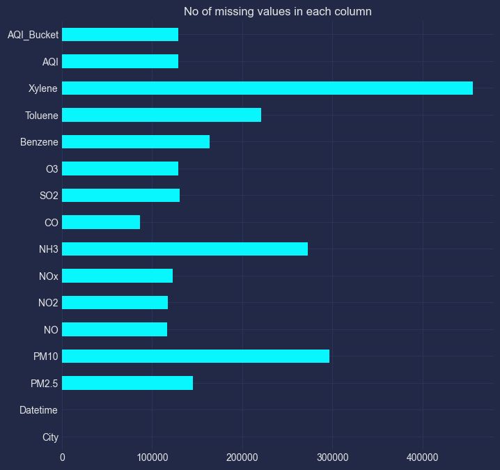

### Plotting the number of values per city
The distribution of data across different cities is visualised below. It allows us to identify which cities have the most and least data collected. This can help us understand any potential biases in the data or if there are any cities with minimal information.

```python
# Countplot of the various cities in the dataset 
df.City.value_counts().plot(kind = 'bar', figsize = (12,6))
plt.title('No of Values in each city')
plt.show()
```
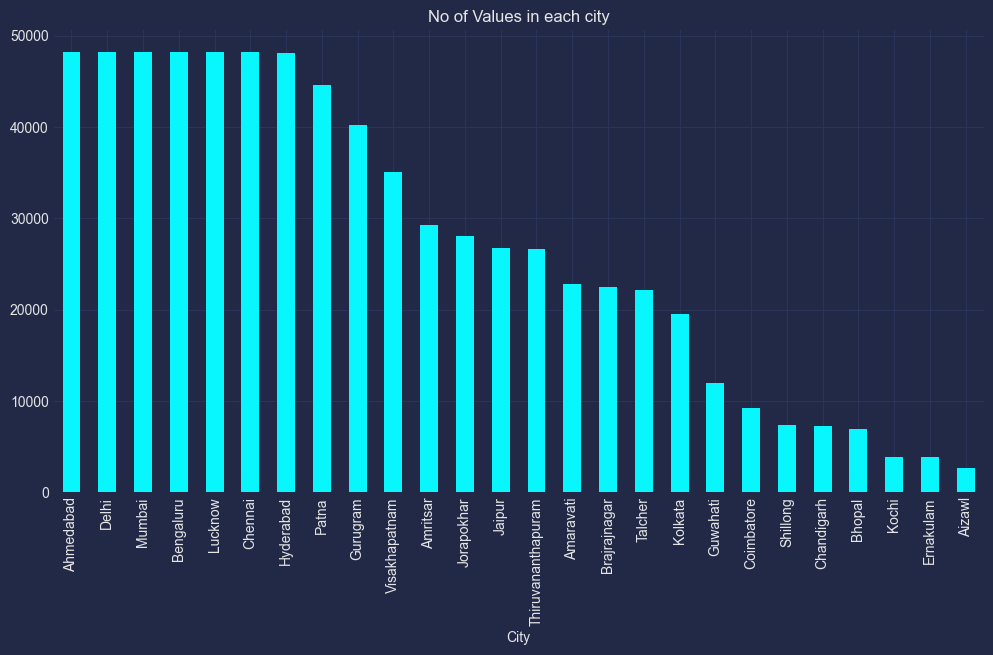

Based on the plot, it is evident that there are seven major cities in the dataset, each having approximately ~48000 rows of data.

###  Missing rows per city
This code analyzes missing air quality data (PM2.5 & PM10) across cities. It identifies rows with missing values and counts them for each city. The results are visualized in a bar chart below to reveal cities with potentially problematic data.

```python
# select rows with missing PM values
missing_pm = df[df[['PM2.5','PM10']].isnull().any(axis =1)]

# Count the number of times eac city has a missing Pm value
missing_city_counts = missing_pm.City.value_counts().reset_index()

# Rename columns to appropiate naming 
missing_city_counts.columns = ['City','Missing']

# Count the number of time each city appears in the dataset
city_counts = df.City.value_counts().reset_index()

# rename the columns
city_counts.columns = ['City','Total']

# merge both tables
missing_city_counts = missing_city_counts.merge(city_counts, on ='City', how = 'right')

#Plot the results
missing_city_counts.plot(x = 'City', y = ['Total','Missing'],kind = 'bar', figsize = (12,6))
plt.title('Plot showing the number of missing rows in each city')
plt.show()
```
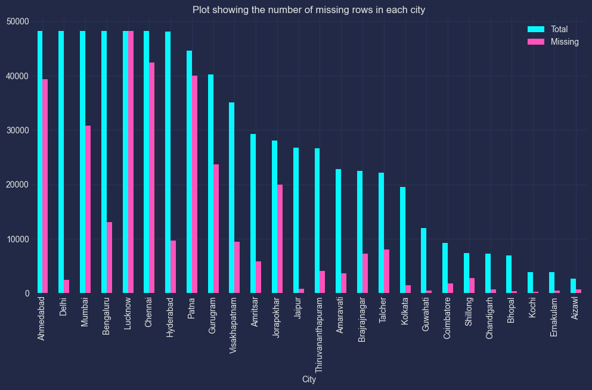
Notably, Lucknow has missing air quality values for all rows, indicating a lack of relevant information for the focus of this research. Consequently, it is advisable to exclude this city from the analysis.

## Correlation Heatmap

```python
print('Correlation Heatmap')
df.select_dtypes([int,float]).corr().style.background_gradient(cmap='coolwarm').format("{:.3}")
```
<div class="output_subarea output_html rendered_html"><style type="text/css">
#T_66e32_row0_col0, #T_66e32_row1_col1, #T_66e32_row2_col2, #T_66e32_row3_col3, #T_66e32_row4_col4, #T_66e32_row5_col5, #T_66e32_row6_col6, #T_66e32_row7_col7, #T_66e32_row8_col8, #T_66e32_row9_col9, #T_66e32_row10_col10, #T_66e32_row11_col11, #T_66e32_row12_col12 {
  background-color: #b40426;
  color: #f1f1f1;
}
#T_66e32_row0_col1, #T_66e32_row1_col0 {
  background-color: #ed8366;
  color: #f1f1f1;
}
#T_66e32_row0_col2, #T_66e32_row12_col4 {
  background-color: #cad8ef;
  color: #000000;
}
#T_66e32_row0_col3 {
  background-color: #92b4fe;
  color: #000000;
}
#T_66e32_row0_col4 {
  background-color: #c9d7f0;
  color: #000000;
}
#T_66e32_row0_col5, #T_66e32_row10_col7 {
  background-color: #8db0fe;
  color: #000000;
}
#T_66e32_row0_col6, #T_66e32_row0_col11, #T_66e32_row10_col8 {
  background-color: #6282ea;
  color: #f1f1f1;
}
#T_66e32_row0_col7 {
  background-color: #6485ec;
  color: #f1f1f1;
}
#T_66e32_row0_col8, #T_66e32_row2_col7, #T_66e32_row5_col8 {
  background-color: #6687ed;
  color: #f1f1f1;
}
#T_66e32_row0_col9, #T_66e32_row1_col9 {
  background-color: #485fd1;
  color: #f1f1f1;
}
#T_66e32_row0_col10, #T_66e32_row11_col12 {
  background-color: #5b7ae5;
  color: #f1f1f1;
}
#T_66e32_row0_col12 {
  background-color: #d6dce4;
  color: #000000;
}
#T_66e32_row1_col2 {
  background-color: #dbdcde;
  color: #000000;
}
#T_66e32_row1_col3 {
  background-color: #c0d4f5;
  color: #000000;
}
#T_66e32_row1_col4 {
  background-color: #e1dad6;
  color: #000000;
}
#T_66e32_row1_col5, #T_66e32_row2_col0, #T_66e32_row4_col12 {
  background-color: #afcafc;
  color: #000000;
}
#T_66e32_row1_col6, #T_66e32_row9_col4 {
  background-color: #6788ee;
  color: #f1f1f1;
}
#T_66e32_row1_col7 {
  background-color: #89acfd;
  color: #000000;
}
#T_66e32_row1_col8, #T_66e32_row3_col11, #T_66e32_row7_col11, #T_66e32_row11_col7 {
  background-color: #7a9df8;
  color: #f1f1f1;
}
#T_66e32_row1_col10, #T_66e32_row12_col11 {
  background-color: #6f92f3;
  color: #f1f1f1;
}
#T_66e32_row1_col11, #T_66e32_row8_col7, #T_66e32_row9_col6 {
  background-color: #5d7ce6;
  color: #f1f1f1;
}
#T_66e32_row1_col12 {
  background-color: #f6bda2;
  color: #000000;
}
#T_66e32_row2_col1 {
  background-color: #c6d6f1;
  color: #000000;
}
#T_66e32_row2_col3 {
  background-color: #c1d4f4;
  color: #000000;
}
#T_66e32_row2_col4 {
  background-color: #eb7d62;
  color: #f1f1f1;
}
#T_66e32_row2_col5, #T_66e32_row12_col8 {
  background-color: #7396f5;
  color: #f1f1f1;
}
#T_66e32_row2_col6 {
  background-color: #b1cbfc;
  color: #000000;
}
#T_66e32_row2_col8, #T_66e32_row5_col7, #T_66e32_row5_col9, #T_66e32_row5_col10, #T_66e32_row5_col11, #T_66e32_row7_col5, #T_66e32_row8_col2, #T_66e32_row8_col4, #T_66e32_row8_col6, #T_66e32_row8_col9, #T_66e32_row8_col11, #T_66e32_row9_col0, #T_66e32_row9_col1, #T_66e32_row9_col3, #T_66e32_row9_col5, #T_66e32_row9_col12, #T_66e32_row11_col5 {
  background-color: #3b4cc0;
  color: #f1f1f1;
}
#T_66e32_row2_col9, #T_66e32_row8_col1 {
  background-color: #536edd;
  color: #f1f1f1;
}
#T_66e32_row2_col10, #T_66e32_row5_col3 {
  background-color: #7295f4;
  color: #f1f1f1;
}
#T_66e32_row2_col11, #T_66e32_row4_col11, #T_66e32_row9_col2 {
  background-color: #6e90f2;
  color: #f1f1f1;
}
#T_66e32_row2_col12 {
  background-color: #a1c0ff;
  color: #000000;
}
#T_66e32_row3_col0, #T_66e32_row10_col6 {
  background-color: #97b8ff;
  color: #000000;
}
#T_66e32_row3_col1, #T_66e32_row12_col2 {
  background-color: #c3d5f4;
  color: #000000;
}
#T_66e32_row3_col2 {
  background-color: #dadce0;
  color: #000000;
}
#T_66e32_row3_col4 {
  background-color: #f6bea4;
  color: #000000;
}
#T_66e32_row3_col5, #T_66e32_row6_col10, #T_66e32_row7_col10 {
  background-color: #84a7fc;
  color: #f1f1f1;
}
#T_66e32_row3_col6 {
  background-color: #9fbfff;
  color: #000000;
}
#T_66e32_row3_col7 {
  background-color: #a2c1ff;
  color: #000000;
}
#T_66e32_row3_col8, #T_66e32_row5_col6 {
  background-color: #6a8bef;
  color: #f1f1f1;
}
#T_66e32_row3_col9 {
  background-color: #4c66d6;
  color: #f1f1f1;
}
#T_66e32_row3_col10 {
  background-color: #8fb1fe;
  color: #000000;
}
#T_66e32_row3_col12, #T_66e32_row12_col3 {
  background-color: #bfd3f6;
  color: #000000;
}
#T_66e32_row4_col0 {
  background-color: #b5cdfa;
  color: #000000;
}
#T_66e32_row4_col1 {
  background-color: #d3dbe7;
  color: #000000;
}
#T_66e32_row4_col2 {
  background-color: #e97a5f;
  color: #f1f1f1;
}
#T_66e32_row4_col3, #T_66e32_row12_col6 {
  background-color: #f2cbb7;
  color: #000000;
}
#T_66e32_row4_col5 {
  background-color: #7093f3;
  color: #f1f1f1;
}
#T_66e32_row4_col6, #T_66e32_row7_col6 {
  background-color: #a3c2fe;
  color: #000000;
}
#T_66e32_row4_col7 {
  background-color: #779af7;
  color: #f1f1f1;
}
#T_66e32_row4_col8 {
  background-color: #4257c9;
  color: #f1f1f1;
}
#T_66e32_row4_col9 {
  background-color: #5470de;
  color: #f1f1f1;
}
#T_66e32_row4_col10, #T_66e32_row11_col6 {
  background-color: #7ea1fa;
  color: #f1f1f1;
}
#T_66e32_row5_col0 {
  background-color: #81a4fb;
  color: #f1f1f1;
}
#T_66e32_row5_col1 {
  background-color: #a5c3fe;
  color: #000000;
}
#T_66e32_row5_col2 {
  background-color: #8caffe;
  color: #000000;
}
#T_66e32_row5_col4, #T_66e32_row10_col12 {
  background-color: #82a6fb;
  color: #f1f1f1;
}
#T_66e32_row5_col12, #T_66e32_row6_col11 {
  background-color: #7597f6;
  color: #f1f1f1;
}
#T_66e32_row6_col0 {
  background-color: #4961d2;
  color: #f1f1f1;
}
#T_66e32_row6_col1, #T_66e32_row11_col1 {
  background-color: #4f69d9;
  color: #f1f1f1;
}
#T_66e32_row6_col2 {
  background-color: #bbd1f8;
  color: #000000;
}
#T_66e32_row6_col3 {
  background-color: #85a8fc;
  color: #f1f1f1;
}
#T_66e32_row6_col4 {
  background-color: #a9c6fd;
  color: #000000;
}
#T_66e32_row6_col5 {
  background-color: #5f7fe8;
  color: #f1f1f1;
}
#T_66e32_row6_col7 {
  background-color: #9abbff;
  color: #000000;
}
#T_66e32_row6_col8 {
  background-color: #4a63d3;
  color: #f1f1f1;
}
#T_66e32_row6_col9 {
  background-color: #516ddb;
  color: #f1f1f1;
}
#T_66e32_row6_col12 {
  background-color: #ead4c8;
  color: #000000;
}
#T_66e32_row7_col0 {
  background-color: #5875e1;
  color: #f1f1f1;
}
#T_66e32_row7_col1 {
  background-color: #7da0f9;
  color: #f1f1f1;
}
#T_66e32_row7_col2, #T_66e32_row11_col4 {
  background-color: #80a3fa;
  color: #f1f1f1;
}
#T_66e32_row7_col3 {
  background-color: #93b5fe;
  color: #000000;
}
#T_66e32_row7_col4, #T_66e32_row11_col2, #T_66e32_row12_col5 {
  background-color: #88abfd;
  color: #000000;
}
#T_66e32_row7_col8 {
  background-color: #7699f6;
  color: #f1f1f1;
}
#T_66e32_row7_col9 {
  background-color: #455cce;
  color: #f1f1f1;
}
#T_66e32_row7_col12 {
  background-color: #aec9fc;
  color: #000000;
}
#T_66e32_row8_col0 {
  background-color: #3e51c5;
  color: #f1f1f1;
}
#T_66e32_row8_col3, #T_66e32_row8_col10 {
  background-color: #3d50c3;
  color: #f1f1f1;
}
#T_66e32_row8_col5 {
  background-color: #4b64d5;
  color: #f1f1f1;
}
#T_66e32_row8_col12, #T_66e32_row9_col7 {
  background-color: #465ecf;
  color: #f1f1f1;
}
#T_66e32_row9_col8, #T_66e32_row11_col0, #T_66e32_row11_col8 {
  background-color: #5572df;
  color: #f1f1f1;
}
#T_66e32_row9_col10 {
  background-color: #f49a7b;
  color: #000000;
}
#T_66e32_row9_col11, #T_66e32_row11_col9 {
  background-color: #c4d5f3;
  color: #000000;
}
#T_66e32_row10_col0 {
  background-color: #5977e3;
  color: #f1f1f1;
}
#T_66e32_row10_col1 {
  background-color: #6c8ff1;
  color: #f1f1f1;
}
#T_66e32_row10_col2 {
  background-color: #94b6ff;
  color: #000000;
}
#T_66e32_row10_col3 {
  background-color: #86a9fc;
  color: #f1f1f1;
}
#T_66e32_row10_col4 {
  background-color: #98b9ff;
  color: #000000;
}
#T_66e32_row10_col5 {
  background-color: #445acc;
  color: #f1f1f1;
}
#T_66e32_row10_col9 {
  background-color: #f39778;
  color: #000000;
}
#T_66e32_row10_col11 {
  background-color: #cbd8ee;
  color: #000000;
}
#T_66e32_row11_col3 {
  background-color: #688aef;
  color: #f1f1f1;
}
#T_66e32_row11_col10 {
  background-color: #c5d6f2;
  color: #000000;
}
#T_66e32_row12_col0 {
  background-color: #d9dce1;
  color: #000000;
}
#T_66e32_row12_col1 {
  background-color: #f7ba9f;
  color: #000000;
}
#T_66e32_row12_col7 {
  background-color: #bcd2f7;
  color: #000000;
}
#T_66e32_row12_col9 {
  background-color: #4e68d8;
  color: #f1f1f1;
}
#T_66e32_row12_col10 {
  background-color: #8badfd;
  color: #000000;
}
</style>
<table id="T_66e32">
  <thead>
    <tr>
      <th class="blank level0">&nbsp;</th>
      <th id="T_66e32_level0_col0" class="col_heading level0 col0">PM2.5</th>
      <th id="T_66e32_level0_col1" class="col_heading level0 col1">PM10</th>
      <th id="T_66e32_level0_col2" class="col_heading level0 col2">NO</th>
      <th id="T_66e32_level0_col3" class="col_heading level0 col3">NO2</th>
      <th id="T_66e32_level0_col4" class="col_heading level0 col4">NOx</th>
      <th id="T_66e32_level0_col5" class="col_heading level0 col5">NH3</th>
      <th id="T_66e32_level0_col6" class="col_heading level0 col6">CO</th>
      <th id="T_66e32_level0_col7" class="col_heading level0 col7">SO2</th>
      <th id="T_66e32_level0_col8" class="col_heading level0 col8">O3</th>
      <th id="T_66e32_level0_col9" class="col_heading level0 col9">Benzene</th>
      <th id="T_66e32_level0_col10" class="col_heading level0 col10">Toluene</th>
      <th id="T_66e32_level0_col11" class="col_heading level0 col11">Xylene</th>
      <th id="T_66e32_level0_col12" class="col_heading level0 col12">AQI</th>
    </tr>
  </thead>
  <tbody>
    <tr>
      <th id="T_66e32_level0_row0" class="row_heading level0 row0">PM2.5</th>
      <td id="T_66e32_row0_col0" class="data row0 col0">1.0</td>
      <td id="T_66e32_row0_col1" class="data row0 col1">0.809</td>
      <td id="T_66e32_row0_col2" class="data row0 col2">0.371</td>
      <td id="T_66e32_row0_col3" class="data row0 col3">0.303</td>
      <td id="T_66e32_row0_col4" class="data row0 col4">0.386</td>
      <td id="T_66e32_row0_col5" class="data row0 col5">0.243</td>
      <td id="T_66e32_row0_col6" class="data row0 col6">0.0829</td>
      <td id="T_66e32_row0_col7" class="data row0 col7">0.125</td>
      <td id="T_66e32_row0_col8" class="data row0 col8">0.0473</td>
      <td id="T_66e32_row0_col9" class="data row0 col9">0.0341</td>
      <td id="T_66e32_row0_col10" class="data row0 col10">0.129</td>
      <td id="T_66e32_row0_col11" class="data row0 col11">0.117</td>
      <td id="T_66e32_row0_col12" class="data row0 col12">0.502</td>
    </tr>
    <tr>
      <th id="T_66e32_level0_row1" class="row_heading level0 row1">PM10</th>
      <td id="T_66e32_row1_col0" class="data row1 col0">0.809</td>
      <td id="T_66e32_row1_col1" class="data row1 col1">1.0</td>
      <td id="T_66e32_row1_col2" class="data row1 col2">0.44</td>
      <td id="T_66e32_row1_col3" class="data row1 col3">0.43</td>
      <td id="T_66e32_row1_col4" class="data row1 col4">0.481</td>
      <td id="T_66e32_row1_col5" class="data row1 col5">0.344</td>
      <td id="T_66e32_row1_col6" class="data row1 col6">0.101</td>
      <td id="T_66e32_row1_col7" class="data row1 col7">0.232</td>
      <td id="T_66e32_row1_col8" class="data row1 col8">0.114</td>
      <td id="T_66e32_row1_col9" class="data row1 col9">0.0353</td>
      <td id="T_66e32_row1_col10" class="data row1 col10">0.186</td>
      <td id="T_66e32_row1_col11" class="data row1 col11">0.101</td>
      <td id="T_66e32_row1_col12" class="data row1 col12">0.669</td>
    </tr>
    <tr>
      <th id="T_66e32_level0_row2" class="row_heading level0 row2">NO</th>
      <td id="T_66e32_row2_col0" class="data row2 col0">0.371</td>
      <td id="T_66e32_row2_col1" class="data row2 col1">0.44</td>
      <td id="T_66e32_row2_col2" class="data row2 col2">1.0</td>
      <td id="T_66e32_row2_col3" class="data row2 col3">0.435</td>
      <td id="T_66e32_row2_col4" class="data row2 col4">0.802</td>
      <td id="T_66e32_row2_col5" class="data row2 col5">0.17</td>
      <td id="T_66e32_row2_col6" class="data row2 col6">0.32</td>
      <td id="T_66e32_row2_col7" class="data row2 col7">0.13</td>
      <td id="T_66e32_row2_col8" class="data row2 col8">-0.106</td>
      <td id="T_66e32_row2_col9" class="data row2 col9">0.0724</td>
      <td id="T_66e32_row2_col10" class="data row2 col10">0.195</td>
      <td id="T_66e32_row2_col11" class="data row2 col11">0.154</td>
      <td id="T_66e32_row2_col12" class="data row2 col12">0.344</td>
    </tr>
    <tr>
      <th id="T_66e32_level0_row3" class="row_heading level0 row3">NO2</th>
      <td id="T_66e32_row3_col0" class="data row3 col0">0.303</td>
      <td id="T_66e32_row3_col1" class="data row3 col1">0.43</td>
      <td id="T_66e32_row3_col2" class="data row3 col2">0.435</td>
      <td id="T_66e32_row3_col3" class="data row3 col3">1.0</td>
      <td id="T_66e32_row3_col4" class="data row3 col4">0.619</td>
      <td id="T_66e32_row3_col5" class="data row3 col5">0.217</td>
      <td id="T_66e32_row3_col6" class="data row3 col6">0.27</td>
      <td id="T_66e32_row3_col7" class="data row3 col7">0.305</td>
      <td id="T_66e32_row3_col8" class="data row3 col8">0.0596</td>
      <td id="T_66e32_row3_col9" class="data row3 col9">0.0516</td>
      <td id="T_66e32_row3_col10" class="data row3 col10">0.274</td>
      <td id="T_66e32_row3_col11" class="data row3 col11">0.19</td>
      <td id="T_66e32_row3_col12" class="data row3 col12">0.429</td>
    </tr>
    <tr>
      <th id="T_66e32_level0_row4" class="row_heading level0 row4">NOx</th>
      <td id="T_66e32_row4_col0" class="data row4 col0">0.386</td>
      <td id="T_66e32_row4_col1" class="data row4 col1">0.481</td>
      <td id="T_66e32_row4_col2" class="data row4 col2">0.802</td>
      <td id="T_66e32_row4_col3" class="data row4 col3">0.619</td>
      <td id="T_66e32_row4_col4" class="data row4 col4">1.0</td>
      <td id="T_66e32_row4_col5" class="data row4 col5">0.162</td>
      <td id="T_66e32_row4_col6" class="data row4 col6">0.279</td>
      <td id="T_66e32_row4_col7" class="data row4 col7">0.179</td>
      <td id="T_66e32_row4_col8" class="data row4 col8">-0.0765</td>
      <td id="T_66e32_row4_col9" class="data row4 col9">0.0751</td>
      <td id="T_66e32_row4_col10" class="data row4 col10">0.229</td>
      <td id="T_66e32_row4_col11" class="data row4 col11">0.152</td>
      <td id="T_66e32_row4_col12" class="data row4 col12">0.386</td>
    </tr>
    <tr>
      <th id="T_66e32_level0_row5" class="row_heading level0 row5">NH3</th>
      <td id="T_66e32_row5_col0" class="data row5 col0">0.243</td>
      <td id="T_66e32_row5_col1" class="data row5 col1">0.344</td>
      <td id="T_66e32_row5_col2" class="data row5 col2">0.17</td>
      <td id="T_66e32_row5_col3" class="data row5 col3">0.217</td>
      <td id="T_66e32_row5_col4" class="data row5 col4">0.162</td>
      <td id="T_66e32_row5_col5" class="data row5 col5">1.0</td>
      <td id="T_66e32_row5_col6" class="data row5 col6">0.108</td>
      <td id="T_66e32_row5_col7" class="data row5 col7">-0.0104</td>
      <td id="T_66e32_row5_col8" class="data row5 col8">0.0488</td>
      <td id="T_66e32_row5_col9" class="data row5 col9">-0.00754</td>
      <td id="T_66e32_row5_col10" class="data row5 col10">0.0246</td>
      <td id="T_66e32_row5_col11" class="data row5 col11">-0.00898</td>
      <td id="T_66e32_row5_col12" class="data row5 col12">0.227</td>
    </tr>
    <tr>
      <th id="T_66e32_level0_row6" class="row_heading level0 row6">CO</th>
      <td id="T_66e32_row6_col0" class="data row6 col0">0.0829</td>
      <td id="T_66e32_row6_col1" class="data row6 col1">0.101</td>
      <td id="T_66e32_row6_col2" class="data row6 col2">0.32</td>
      <td id="T_66e32_row6_col3" class="data row6 col3">0.27</td>
      <td id="T_66e32_row6_col4" class="data row6 col4">0.279</td>
      <td id="T_66e32_row6_col5" class="data row6 col5">0.108</td>
      <td id="T_66e32_row6_col6" class="data row6 col6">1.0</td>
      <td id="T_66e32_row6_col7" class="data row6 col7">0.279</td>
      <td id="T_66e32_row6_col8" class="data row6 col8">-0.0491</td>
      <td id="T_66e32_row6_col9" class="data row6 col9">0.0687</td>
      <td id="T_66e32_row6_col10" class="data row6 col10">0.244</td>
      <td id="T_66e32_row6_col11" class="data row6 col11">0.172</td>
      <td id="T_66e32_row6_col12" class="data row6 col12">0.58</td>
    </tr>
    <tr>
      <th id="T_66e32_level0_row7" class="row_heading level0 row7">SO2</th>
      <td id="T_66e32_row7_col0" class="data row7 col0">0.125</td>
      <td id="T_66e32_row7_col1" class="data row7 col1">0.232</td>
      <td id="T_66e32_row7_col2" class="data row7 col2">0.13</td>
      <td id="T_66e32_row7_col3" class="data row7 col3">0.305</td>
      <td id="T_66e32_row7_col4" class="data row7 col4">0.179</td>
      <td id="T_66e32_row7_col5" class="data row7 col5">-0.0104</td>
      <td id="T_66e32_row7_col6" class="data row7 col6">0.279</td>
      <td id="T_66e32_row7_col7" class="data row7 col7">1.0</td>
      <td id="T_66e32_row7_col8" class="data row7 col8">0.101</td>
      <td id="T_66e32_row7_col9" class="data row7 col9">0.0291</td>
      <td id="T_66e32_row7_col10" class="data row7 col10">0.243</td>
      <td id="T_66e32_row7_col11" class="data row7 col11">0.188</td>
      <td id="T_66e32_row7_col12" class="data row7 col12">0.383</td>
    </tr>
    <tr>
      <th id="T_66e32_level0_row8" class="row_heading level0 row8">O3</th>
      <td id="T_66e32_row8_col0" class="data row8 col0">0.0473</td>
      <td id="T_66e32_row8_col1" class="data row8 col1">0.114</td>
      <td id="T_66e32_row8_col2" class="data row8 col2">-0.106</td>
      <td id="T_66e32_row8_col3" class="data row8 col3">0.0596</td>
      <td id="T_66e32_row8_col4" class="data row8 col4">-0.0765</td>
      <td id="T_66e32_row8_col5" class="data row8 col5">0.0488</td>
      <td id="T_66e32_row8_col6" class="data row8 col6">-0.0491</td>
      <td id="T_66e32_row8_col7" class="data row8 col7">0.101</td>
      <td id="T_66e32_row8_col8" class="data row8 col8">1.0</td>
      <td id="T_66e32_row8_col9" class="data row8 col9">-0.00962</td>
      <td id="T_66e32_row8_col10" class="data row8 col10">0.034</td>
      <td id="T_66e32_row8_col11" class="data row8 col11">-0.01</td>
      <td id="T_66e32_row8_col12" class="data row8 col12">0.0929</td>
    </tr>
    <tr>
      <th id="T_66e32_level0_row9" class="row_heading level0 row9">Benzene</th>
      <td id="T_66e32_row9_col0" class="data row9 col0">0.0341</td>
      <td id="T_66e32_row9_col1" class="data row9 col1">0.0353</td>
      <td id="T_66e32_row9_col2" class="data row9 col2">0.0724</td>
      <td id="T_66e32_row9_col3" class="data row9 col3">0.0516</td>
      <td id="T_66e32_row9_col4" class="data row9 col4">0.0751</td>
      <td id="T_66e32_row9_col5" class="data row9 col5">-0.00754</td>
      <td id="T_66e32_row9_col6" class="data row9 col6">0.0687</td>
      <td id="T_66e32_row9_col7" class="data row9 col7">0.0291</td>
      <td id="T_66e32_row9_col8" class="data row9 col8">-0.00962</td>
      <td id="T_66e32_row9_col9" class="data row9 col9">1.0</td>
      <td id="T_66e32_row9_col10" class="data row9 col10">0.754</td>
      <td id="T_66e32_row9_col11" class="data row9 col11">0.407</td>
      <td id="T_66e32_row9_col12" class="data row9 col12">0.0538</td>
    </tr>
    <tr>
      <th id="T_66e32_level0_row10" class="row_heading level0 row10">Toluene</th>
      <td id="T_66e32_row10_col0" class="data row10 col0">0.129</td>
      <td id="T_66e32_row10_col1" class="data row10 col1">0.186</td>
      <td id="T_66e32_row10_col2" class="data row10 col2">0.195</td>
      <td id="T_66e32_row10_col3" class="data row10 col3">0.274</td>
      <td id="T_66e32_row10_col4" class="data row10 col4">0.229</td>
      <td id="T_66e32_row10_col5" class="data row10 col5">0.0246</td>
      <td id="T_66e32_row10_col6" class="data row10 col6">0.244</td>
      <td id="T_66e32_row10_col7" class="data row10 col7">0.243</td>
      <td id="T_66e32_row10_col8" class="data row10 col8">0.034</td>
      <td id="T_66e32_row10_col9" class="data row10 col9">0.754</td>
      <td id="T_66e32_row10_col10" class="data row10 col10">1.0</td>
      <td id="T_66e32_row10_col11" class="data row10 col11">0.429</td>
      <td id="T_66e32_row10_col12" class="data row10 col12">0.261</td>
    </tr>
    <tr>
      <th id="T_66e32_level0_row11" class="row_heading level0 row11">Xylene</th>
      <td id="T_66e32_row11_col0" class="data row11 col0">0.117</td>
      <td id="T_66e32_row11_col1" class="data row11 col1">0.101</td>
      <td id="T_66e32_row11_col2" class="data row11 col2">0.154</td>
      <td id="T_66e32_row11_col3" class="data row11 col3">0.19</td>
      <td id="T_66e32_row11_col4" class="data row11 col4">0.152</td>
      <td id="T_66e32_row11_col5" class="data row11 col5">-0.00898</td>
      <td id="T_66e32_row11_col6" class="data row11 col6">0.172</td>
      <td id="T_66e32_row11_col7" class="data row11 col7">0.188</td>
      <td id="T_66e32_row11_col8" class="data row11 col8">-0.01</td>
      <td id="T_66e32_row11_col9" class="data row11 col9">0.407</td>
      <td id="T_66e32_row11_col10" class="data row11 col10">0.429</td>
      <td id="T_66e32_row11_col11" class="data row11 col11">1.0</td>
      <td id="T_66e32_row11_col12" class="data row11 col12">0.157</td>
    </tr>
    <tr>
      <th id="T_66e32_level0_row12" class="row_heading level0 row12">AQI</th>
      <td id="T_66e32_row12_col0" class="data row12 col0">0.502</td>
      <td id="T_66e32_row12_col1" class="data row12 col1">0.669</td>
      <td id="T_66e32_row12_col2" class="data row12 col2">0.344</td>
      <td id="T_66e32_row12_col3" class="data row12 col3">0.429</td>
      <td id="T_66e32_row12_col4" class="data row12 col4">0.386</td>
      <td id="T_66e32_row12_col5" class="data row12 col5">0.227</td>
      <td id="T_66e32_row12_col6" class="data row12 col6">0.58</td>
      <td id="T_66e32_row12_col7" class="data row12 col7">0.383</td>
      <td id="T_66e32_row12_col8" class="data row12 col8">0.0929</td>
      <td id="T_66e32_row12_col9" class="data row12 col9">0.0538</td>
      <td id="T_66e32_row12_col10" class="data row12 col10">0.261</td>
      <td id="T_66e32_row12_col11" class="data row12 col11">0.157</td>
      <td id="T_66e32_row12_col12" class="data row12 col12">1.0</td>
    </tr>
  </tbody>
</table>
</div>

The PM10 and PM2.5 air quality indices exhibit a strong positive correlation.

## Extracting Temporal Features

Date and time information were transformed to extract features like month, day of week, hour, and year, to enable exploration of temporal patterns.

```python
import calendar

df['month']=df.Datetime.dt.month
df['day']=df.Datetime.dt.day
df['day_of_week']=df.Datetime.dt.day_of_week
df['hour']=df.Datetime.dt.hour
df['day_name']=df.Datetime.dt.day_name()
df['year']=df.Datetime.dt.year
df['month_name']=df['month'].apply(lambda x:calendar.month_name[x])
df.sort_values('Datetime',inplace=True)
df.head()
```
<table border="1" class="dataframe">
  <thead>
    <tr style="text-align: right;">
      <th></th>
      <th>City</th>
      <th>Datetime</th>
      <th>PM2.5</th>
      <th>PM10</th>
      <th>NO</th>
      <th>NO2</th>
      <th>NOx</th>
      <th>NH3</th>
      <th>CO</th>
      <th>SO2</th>
      <th>...</th>
      <th>Xylene</th>
      <th>AQI</th>
      <th>AQI_Bucket</th>
      <th>month</th>
      <th>day</th>
      <th>day_of_week</th>
      <th>hour</th>
      <th>day_name</th>
      <th>year</th>
      <th>month_name</th>
    </tr>
  </thead>
  <tbody>
    <tr>
      <th>0</th>
      <td>Ahmedabad</td>
      <td>2015-01-01 01:00:00</td>
      <td>NaN</td>
      <td>NaN</td>
      <td>1.00</td>
      <td>40.01</td>
      <td>36.37</td>
      <td>NaN</td>
      <td>1.00</td>
      <td>122.07</td>
      <td>...</td>
      <td>0.00</td>
      <td>NaN</td>
      <td>NaN</td>
      <td>1</td>
      <td>1</td>
      <td>3</td>
      <td>1</td>
      <td>Thursday</td>
      <td>2015</td>
      <td>January</td>
    </tr>
    <tr>
      <th>187751</th>
      <td>Chennai</td>
      <td>2015-01-01 01:00:00</td>
      <td>NaN</td>
      <td>NaN</td>
      <td>41.56</td>
      <td>47.97</td>
      <td>57.25</td>
      <td>6.36</td>
      <td>0.92</td>
      <td>7.19</td>
      <td>...</td>
      <td>NaN</td>
      <td>NaN</td>
      <td>NaN</td>
      <td>1</td>
      <td>1</td>
      <td>3</td>
      <td>1</td>
      <td>Thursday</td>
      <td>2015</td>
      <td>January</td>
    </tr>
    <tr>
      <th>245172</th>
      <td>Delhi</td>
      <td>2015-01-01 01:00:00</td>
      <td>454.58</td>
      <td>935.18</td>
      <td>81.52</td>
      <td>41.78</td>
      <td>187.66</td>
      <td>27.54</td>
      <td>9.29</td>
      <td>3.41</td>
      <td>...</td>
      <td>13.80</td>
      <td>NaN</td>
      <td>NaN</td>
      <td>1</td>
      <td>1</td>
      <td>3</td>
      <td>1</td>
      <td>Thursday</td>
      <td>2015</td>
      <td>January</td>
    </tr>
    <tr>
      <th>475670</th>
      <td>Lucknow</td>
      <td>2015-01-01 01:00:00</td>
      <td>NaN</td>
      <td>NaN</td>
      <td>2.26</td>
      <td>12.38</td>
      <td>4.22</td>
      <td>NaN</td>
      <td>12.92</td>
      <td>169.28</td>
      <td>...</td>
      <td>NaN</td>
      <td>NaN</td>
      <td>NaN</td>
      <td>1</td>
      <td>1</td>
      <td>3</td>
      <td>1</td>
      <td>Thursday</td>
      <td>2015</td>
      <td>January</td>
    </tr>
    <tr>
      <th>523862</th>
      <td>Mumbai</td>
      <td>2015-01-01 01:00:00</td>
      <td>NaN</td>
      <td>NaN</td>
      <td>NaN</td>
      <td>NaN</td>
      <td>24.38</td>
      <td>NaN</td>
      <td>0.00</td>
      <td>NaN</td>
      <td>...</td>
      <td>0.00</td>
      <td>NaN</td>
      <td>NaN</td>
      <td>1</td>
      <td>1</td>
      <td>3</td>
      <td>1</td>
      <td>Thursday</td>
      <td>2015</td>
      <td>January</td>
    </tr>
    
  </tbody>
</table>

## Air Quality Trends

Average yearly PM2.5 and PM10 concentrations exhibited decline over the period 2015-2020, suggesting potential improvements in air quality.
```python
from matplotlib.ticker import FormatStrFormatter

df.groupby('year')[['PM2.5','PM10']].mean().plot(figsize=(12,6))
plt.title('Average PM2.5 and PM10 from 2015 to 2020')
plt.gca().yaxis.set_major_formatter(FormatStrFormatter('%d μg/m3'))
mplcyberpunk.add_glow_effects()
plt.show()
```

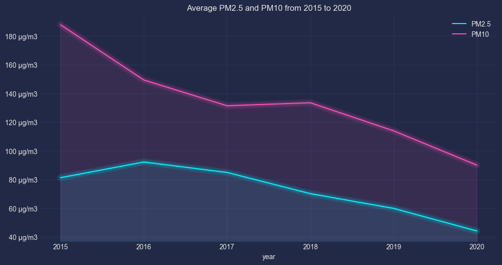


Monthly variations showcased fluctuating pollution levels, with seasonal patterns requiring further investigation.
```python
df.groupby(['month','month_name'])[['PM2.5','PM10']].mean().reset_index().plot(x='month_name',y=['PM2.5','PM10'],kind='bar',stacked=False,figsize=(15,6))
plt.gca().yaxis.set_major_formatter(FormatStrFormatter('%d μg/m3'))
plt.title('Average PM2.5 and PM10 values for each month')
plt.show()
```
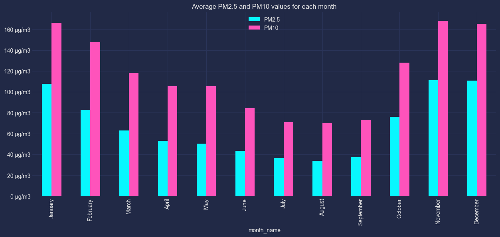

Daily and hourly patterns were also analyzed, revealing trends that could be linked to factors like traffic or industrial activity.
```python
df.groupby(['day_of_week','day_name'])[['PM2.5','PM10']].mean().reset_index().plot(x='day_name',y=['PM2.5','PM10'],stacked=False,kind='bar',figsize=(12,6))
plt.title('Average PM2.5 and PM10 values for each day of the week')
plt.show()
```
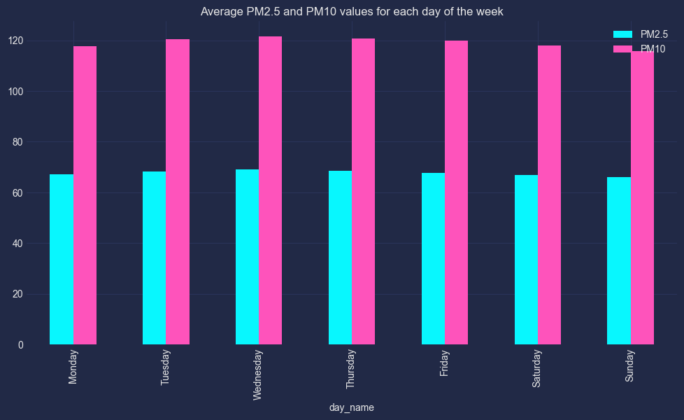
```python
df.groupby('hour')[['PM2.5','PM10']].mean().plot(kind='bar',stacked=False,figsize=(15,6))

plt.title('Average Hourly Air Quality ')

plt.show()
```
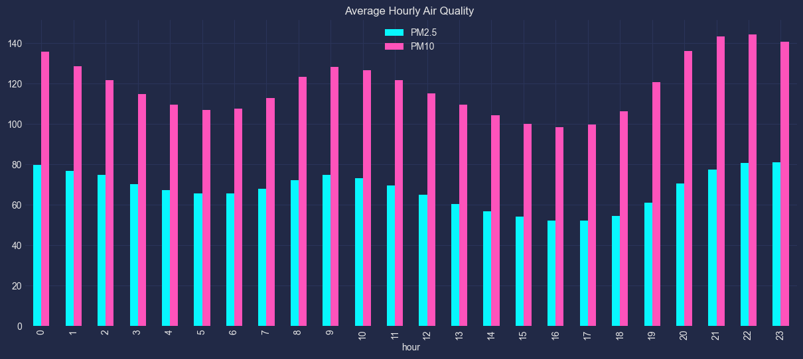

## Focusing on Major Cities
The seven most populous cities were selected for further investigation.

```python
# selecting the 7 most populous cities
selected_cities = df.City.value_counts()[:7].index.values
selected_df = df[df['City'].isin(selected_cities)]
```

Missing value patterns across days of the week were compared for each city, providing insights into potential data collection inconsistencies.

```python
# loop thorugh the city_df for each of the major cities
for _,city_df in selected_df.groupby('City'): 

    #select rows wiith missing PM values 
    missing_pm = city_df[city_df[['PM2.5','PM10']].isnull().any(axis =1)]

    #Count number of missing PM values per day 
    missing_city_counts = missing_pm.day_name.value_counts().reset_index()

    #rename columns
    missing_city_counts.columns = ['Day of Week','Missing']

    # plotting the results with specified order of day of the week
    day_order = ['Monday','Tuesday','Wednesday','Thursday','Friday','Saturday','Sunday']
    sns.barplot(data = missing_city_counts, x = 'Day of Week', y = 'Missing', order = day_order)

    #adding title to the plot
    plt.title(f'Plot showing the number of missing rows in for each of {_} for each of day of week')
    plt.show()
```
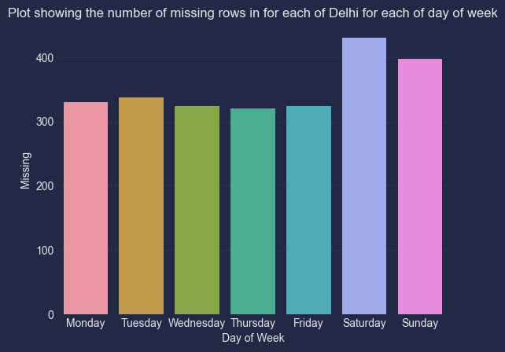
> Showing plot only for Delhi. Plots for the 6 other cities can be viewed in the full notebook.

This visualization depicts the average air quality levels for the selected city. Note the differences.
```python
# Grouping data by city and plotting the mean air pollution values for each city
selected_df.groupby('City')[['PM2.5','PM10']].mean().plot(kind='bar', stacked=False, figsize=(5,3))
plt.title('Average Air Quality for each city')

plt.show()
```
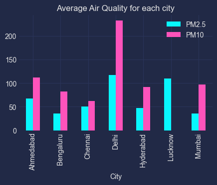

Time-series analysis explored trends in PM2.5 and PM10 concentrations for each city over the years. This revealed city-specific patterns that warrant further exploration.
```python
# plotting average for PM10 for each city over the years
selected_df.pivot_table(columns='City' , aggfunc='mean',values = 'PM10',index= 'year').reset_index(drop = False).plot(x = 'year',y = ['Ahmedabad', 'Bengaluru', 'Chennai', 'Delhi', 'Hyderabad', 'Mumbai'],figsize=(8,4))
plt.title('Average PM10 from 2015 to 2020')
mplcyberpunk.add_glow_effects()
plt.show()
```
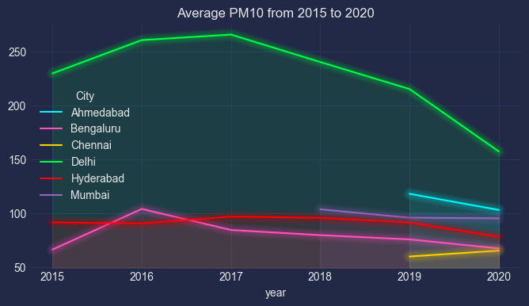


```python
# plotting average for PM2.5 for each city over the years
selected_df.pivot_table(columns='City', aggfunc='mean',values = 'PM2.5',index= 'year').reset_index(drop = False).plot(x = 'year', y = ['Ahmedabad', 'Bengaluru', 'Chennai', 'Delhi', 'Hyderabad', 'Mumbai'], figsize=(8,4))
plt.title('Average PM2.5 from 2015 to 2020 for the diffetent cities')
mplcyberpunk.add_glow_effects()
plt.show()
```
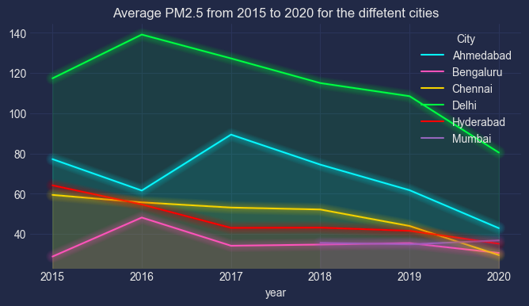

Daily and hourly air pollution variations within each major city were examined, offering valuable details for understanding local pollution dynamics.

```python
# group data by city
for _ ,city_df in selected_df.groupby('City'):
    # for each city plot the average air pollution values for each dy of the week 
    city_df.groupby(['day_of_week','day_name'])[['PM2.5','PM10']].mean().reset_index().plot(x='day_name',y=['PM2.5','PM10'],stacked=False,kind='bar',figsize=(8,4))
    
    #add title to the plot 
    plt.title(f'Average PM2.5 and PM10 values for each day of the week in {_}')
    plt.show()
```
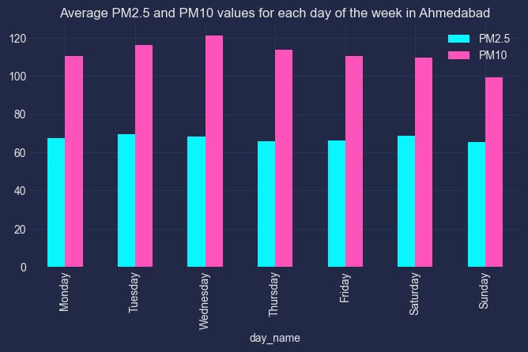
> Showing plot only for Ahmedabad. Plots for the 6 other cities can be viewed in the full notebook.

```python
# loop through data per city
for _,city_df in selected_df.groupby('City'):

    #for the selected city, plot average air pollution value for each hour of the day 
    city_df.groupby('hour')[['PM2.5','PM10']].mean().reset_index().plot(x='hour',y=['PM2.5','PM10'],stacked=False,kind='bar',figsize=(8,4))

    #add title to plot 
    plt.title(f'Average Hourly PM2.5 and PM10 values  in {_}')

    #display plot
    plt.show()
```
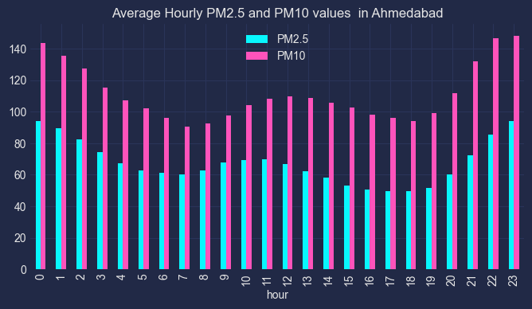
> Showing plot only for Ahmedabad. Plots for the 6 other cities can be viewed in the full notebook.

```python
for _,city_df in selected_df.groupby('City'):
    city_df.groupby(['month','month_name'])[['PM2.5','PM10']].mean().reset_index().plot(x='month_name',y=['PM2.5','PM10'],kind='bar',stacked=False,figsize=(5,3))
    plt.title(f'Average monthly PM2.5 and PM10 values in {_}')
    plt.show()
```
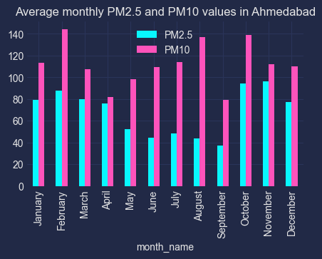
> Showing plot only for Ahmedabad. Plots for the 6 other cities can be viewed in the full notebook.

## Comparative Analysis of Pollutants
The analysis extended beyond PM2.5 and PM10 to include other pollutants like NO, NO2, SO2, and O3. Average values for each pollutant were compared across the major cities, providing a broader picture of air quality variations.

```python
pollution_cols = ['NO', 'NO2', 'NOx', 'NH3', 'CO','SO2', 'O3', 'Benzene', 'Toluene', 'Xylene']

# plot average value ofpollutant for each city
for col in pollution_cols :
    selected_df.groupby('City')[[col]].mean().plot(kind='bar',stacked=False,figsize=(5,2))
    plt.title(f'Average {col} value for each city')
    plt.show()
    
```
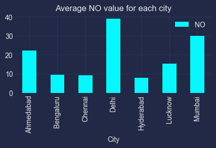
> Showing plot only for NO. Plots for the other pollutants can be viewed in the full notebook.

## Building Baseline Models

This section focused on building baseline models for predicting PM2.5 concentrations in Delhi, using two approaches: ARIMA and [Facebook Prophet](https://facebook.github.io/prophet/).
### Importing arima model and metrics
```python
from statsmodels.tsa.arima.model import ARIMA
from sklearn.metrics import mean_squared_error,r2_score
from math import sqrt
from tqdm import tqdm 
from datetime import date,datetime,timedelta  
```
A time-based split was implemented to separate the data into training and testing sets.

```python
#specifying split date 
split_date = datetime(2020,1,1,0,0,0)

# forward filling missing values
selected_df['PM2.5'].ffill(inplace = True)

# splitting into train and test 
train_df = selected_df[selected_df['Datetime']< split_date]
test_df = selected_df[selected_df['Datetime']>= split_date]
```
###  Building ARIMA model and Validation
Walk-forward validation was employed to evaluate model performance.

```python
# list to collect all predicted and actual values 
all_test = []
all_preds = []

# run through for each city
for city in selected_cities:
    print(f'Training ARIMA model for {city}')

    #selecting the train and test values for the city
    train = train_df[train_df['City'] == city]['PM2.5'].ffill().values
    test = test_df[test_df['City'] == city]['PM2.5'].ffill().values

    # keep history of train values
    history = [x for x in train]
    predictions = []
    # walk-forward validation
    for t in tqdm(range(0,len(test),24)):
        #fit arima model on train set
        model = ARIMA(history, order=(5,1,0))
        model_fit = model.fit()

        # forecast for the next day i.e next 24 hours 
        yhat = model_fit.forecast(24)

        # add forecast values to the list of predictions
        predictions+=list(yhat)
        obs = list(test[t:t+24])
        history+=obs
    predictions = predictions[:len(test)]
    all_preds += predictions 
    all_test += test
    # evaluate forecasts
    rmse = sqrt(mean_squared_error(test, predictions))
    print('Test RMSE: %.3f' % rmse)
    print(f'R2_score {r2_score(test,predictions)}')
    # plot forecasts against actual outcomes
    plt.plot(test)
    plt.title('Plot showing the prediicted Air pollution values and the actual ')
    plt.plot(predictions, color='red')
    plt.show()  

# evaluate overall forecast 
rmse = sqrt(mean_squared_error(all_test, all_preds))
print('Overall Test RMSE: %.3f' % rmse)
print(f'Overall R2_score {r2_score(all_test,all_preds)}')
```
> Training ARIMA model for Ahmedabad. Plot for the other cities can be found in the linked Google Colab Notebook

  0%|          | 0/42 [00:00<?, ?it/s]

100%|██████████| 42/42 [02:09<00:00,  3.09s/it]

Test RMSE: 41.104
R2_score -0.4261053730377651

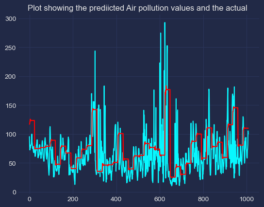

## Training facebook-prophet model

```python
# import facebook-prophet model
from prophet import Prophet
from prophet.plot import add_changepoints_to_plot

all_y_test = []
all_preds = []
for city in selected_cities:
    new_split_date = split_date
    print(f'Training Facebook Prophet model for {city}')
    city_df = selected_df[selected_df['City'] == city][['Datetime','PM2.5']]
    DAYS = (city_df.Datetime.max() - new_split_date).days 

    preds = []
    y_test = []

    # walk-forward validation
    for t in range(DAYS-1):
        city_train_df = city_df[city_df['Datetime']< new_split_date]
        city_train_df.columns = ['ds','y']
        y_test += list(city_df[city_df['Datetime'] >= new_split_date].head(24)['PM2.5'].values)
        city_test_df = city_df[city_df['Datetime'] >= new_split_date].head(24)[['Datetime']]
        city_test_df.columns = ['ds']
        m = Prophet()
        m.fit(city_train_df)
        yhat = m.predict(city_test_df)['yhat'].values
        preds += list(yhat)
        new_split_date += timedelta(days=1)
    
    #preds = preds[:len(test)]
    all_preds += preds
    all_y_test += y_test

    # evaluate forecasts
    rmse = sqrt(mean_squared_error(y_test, preds))
    print('Test RMSE: %.3f' % rmse)
    print(f'R2_score {r2_score(y_test,preds)}')


    # plot forecasts against actual outcomes
    plt.plot(y_test)
    plt.title('Plot showing the prediicted Air pollution values and the actual ')
    plt.plot(preds, color='red')
    plt.show()  

rmse = sqrt(mean_squared_error(all_y_test, all_preds))
print('Overall Test RMSE: %.3f' % rmse)
print(f'Overall R2_score {r2_score(all_y_test,all_preds)}')
```
>Training Facebook Prophet model for Ahmedabad. See Google Colab Notebook for other cities

>18:33:19 - cmdstanpy - INFO - Chain [1] start processing
18:33:49 - cmdstanpy - INFO - Chain [1] done processing
18:33:54 - cmdstanpy - INFO - Chain [1] start processing
18:34:22 - cmdstanpy - INFO - Chain [1] done processing
18:34:27 - cmdstanpy - INFO - Chain [1] start processing
18:34:46 - cmdstanpy - INFO - Chain [1] done processing
18:34:50 - cmdstanpy - INFO - Chain [1] start processing
18:35:21 - cmdstanpy - INFO - Chain [1] done processing
18:35:25 - cmdstanpy - INFO - Chain [1] start processing
18:35:52 - cmdstanpy - INFO - Chain [1] done processing
18:35:56 - cmdstanpy - INFO - Chain [1] start processing
18:36:26 - cmdstanpy - INFO - Chain [1] done processing
18:36:30 - cmdstanpy - INFO - Chain [1] start processing
18:36:57 - cmdstanpy - INFO - Chain [1] done processing

Test RMSE: 16.505
R2_score 0.17762895513012522
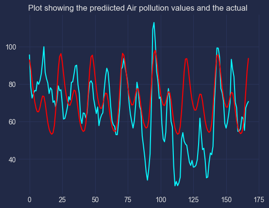

## Conclusion
This air quality analysis provides valuable insights into pollution levels and potential influencing factors across several cities. The identified trends and patterns offer a foundation for further investigation and potential air quality improvement initiatives.

The full notebook can be viewed on Google Colab [here](https://colab.research.google.com/drive/1v5ExfV6FIsWYEic-r-OQLnxpKK2dkNgn?usp=sharing)