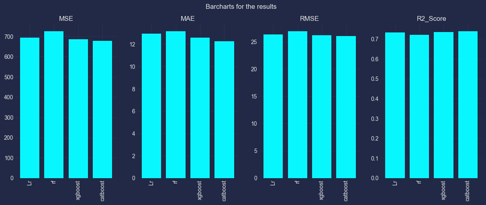

Our previous exploration leveraged ARIMA for air quality predictions. This time, we shift gears to explore the potential of machine learning. We'll utilize a dataset of hourly air quality measurements from various cities. Here, we aim to extract features and train machine learning models to predict PM2.5 concentrations.

By incorporating machine learning, we hope to uncover deeper insights and potentially achieve more accurate air quality predictions for these cities.

## Setting Up the Environment and Loading Data
```python
import pandas as pd
pd.set_option('display.max_columns', None)

import numpy as np
import seaborn as sns
from matplotlib import pyplot as plt

#!pip install mplcyberpunk -qq
import mplcyberpunk
plt.style.use('cyberpunk')

import warnings
warnings.filterwarnings('ignore')


import calendar
import random
import os
```
```python
df = pd.read_csv('city_hour.csv',parse_dates=['Datetime'])

#extract month, day, day of week, month, year, hour from datetime column
df['month']=df.Datetime.dt.month
df['day']=df.Datetime.dt.day
df['day_of_week']=df.Datetime.dt.day_of_week
df['hour']=df.Datetime.dt.hour
df['day_name']=df.Datetime.dt.day_name()
df['year']=df.Datetime.dt.year
df['month_name']=df['month'].apply(lambda x:calendar.month_name[x])

# sort dataset by date
df.sort_values('Datetime',inplace=True)
df.head()
```
<table border="1" class="dataframe">
  <thead>
    <tr style="text-align: right;">
      <th></th>
      <th>City</th>
      <th>Datetime</th>
      <th>PM2.5</th>
      <th>PM10</th>
      <th>NO</th>
      <th>NO2</th>
      <th>NOx</th>
      <th>NH3</th>
      <th>CO</th>
      <th>SO2</th>
      <th>O3</th>
      <th>Benzene</th>
      <th>Toluene</th>
      <th>Xylene</th>
      <th>AQI</th>
      <th>AQI_Bucket</th>
      <th>month</th>
      <th>day</th>
      <th>day_of_week</th>
      <th>hour</th>
      <th>day_name</th>
      <th>year</th>
      <th>month_name</th>
    </tr>
  </thead>
  <tbody>
    <tr>
      <th>0</th>
      <td>Ahmedabad</td>
      <td>2015-01-01 01:00:00</td>
      <td>NaN</td>
      <td>NaN</td>
      <td>1.00</td>
      <td>40.01</td>
      <td>36.37</td>
      <td>NaN</td>
      <td>1.00</td>
      <td>122.07</td>
      <td>NaN</td>
      <td>0.00</td>
      <td>0.00</td>
      <td>0.00</td>
      <td>NaN</td>
      <td>NaN</td>
      <td>1</td>
      <td>1</td>
      <td>3</td>
      <td>1</td>
      <td>Thursday</td>
      <td>2015</td>
      <td>January</td>
    </tr>
    <tr>
      <th>187751</th>
      <td>Chennai</td>
      <td>2015-01-01 01:00:00</td>
      <td>NaN</td>
      <td>NaN</td>
      <td>41.56</td>
      <td>47.97</td>
      <td>57.25</td>
      <td>6.36</td>
      <td>0.92</td>
      <td>7.19</td>
      <td>7.65</td>
      <td>0.11</td>
      <td>NaN</td>
      <td>NaN</td>
      <td>NaN</td>
      <td>NaN</td>
      <td>1</td>
      <td>1</td>
      <td>3</td>
      <td>1</td>
      <td>Thursday</td>
      <td>2015</td>
      <td>January</td>
    </tr>
    <tr>
      <th>245172</th>
      <td>Delhi</td>
      <td>2015-01-01 01:00:00</td>
      <td>454.58</td>
      <td>935.18</td>
      <td>81.52</td>
      <td>41.78</td>
      <td>187.66</td>
      <td>27.54</td>
      <td>9.29</td>
      <td>3.41</td>
      <td>54.94</td>
      <td>25.24</td>
      <td>58.57</td>
      <td>13.80</td>
      <td>NaN</td>
      <td>NaN</td>
      <td>1</td>
      <td>1</td>
      <td>3</td>
      <td>1</td>
      <td>Thursday</td>
      <td>2015</td>
      <td>January</td>
    </tr>
    <tr>
      <th>475670</th>
      <td>Lucknow</td>
      <td>2015-01-01 01:00:00</td>
      <td>NaN</td>
      <td>NaN</td>
      <td>2.26</td>
      <td>12.38</td>
      <td>4.22</td>
      <td>NaN</td>
      <td>12.92</td>
      <td>169.28</td>
      <td>23.96</td>
      <td>1.63</td>
      <td>4.75</td>
      <td>NaN</td>
      <td>NaN</td>
      <td>NaN</td>
      <td>1</td>
      <td>1</td>
      <td>3</td>
      <td>1</td>
      <td>Thursday</td>
      <td>2015</td>
      <td>January</td>
    </tr>
    <tr>
      <th>523862</th>
      <td>Mumbai</td>
      <td>2015-01-01 01:00:00</td>
      <td>NaN</td>
      <td>NaN</td>
      <td>NaN</td>
      <td>NaN</td>
      <td>24.38</td>
      <td>NaN</td>
      <td>0.00</td>
      <td>NaN</td>
      <td>NaN</td>
      <td>0.00</td>
      <td>0.00</td>
      <td>0.00</td>
      <td>NaN</td>
      <td>NaN</td>
      <td>1</td>
      <td>1</td>
      <td>3</td>
      <td>1</td>
      <td>Thursday</td>
      <td>2015</td>
      <td>January</td>
    </tr>
   
  </tbody>
</table>

## Focusing on Major Cities
The seven most populous cities were selected for further investigation.

```python
# selecting the 7 most populous cities
selected_cities = df.City.value_counts()[:7].index.values
selected_df = df[df['City'].isin(selected_cities)]
```

## Feature Engineering
Not all data is perfect, and this air quality dataset is no exception. Here, we tackle the challenge of missing values, particularly for PM2.5 measurements. We'll employ a two-pronged approach:

1.  **Forward Filling:** We'll strategically fill in missing PM2.5 values by looking at the immediately preceding valid value for that city and hour.
2.  **Strategic Dropping:** After filling, we'll remove any remaining rows with missing PM2.5 data, ensuring our models train on complete observations.

This process helps mitigate the impact of missing values and prepares the data for robust modeling.

```python
# creating a copy of the dataset to hold the features
features_df = selected_df.copy()

# sorting data by city and datetime
features_df.sort_values(['City','Datetime'], inplace = True)

# forward Filling missing values
features_df['PM2.5'].ffill(inplace = True)

# drop missing values
features_df = features_df.loc[~features_df['PM2.5'].isnull()]
```
## Capturing the Bigger Picture: Extracting Expanding Features

Air quality doesn't exist in isolation. It can be influenced by factors that accumulate over time. To capture these trends, we'll extract expanding features. These features relate to how PM2.5 measurements change over time within a city.

For instance, we'll calculate expanding statistics like mean, minimum, and maximum PM2.5 since the beginning of the day or even the entire week. This allows our models to consider the evolving air quality context within each city.

```python
cont_cols = ['PM2.5','PM10']
features_df[add_prefix('expanding','mean',cont_cols)]=features_df.groupby('City')[cont_cols].expanding().mean().values
features_df[add_prefix('expanding','min',cont_cols)]=features_df.groupby('City')[cont_cols].expanding().min().values
features_df[add_prefix('expanding','max',cont_cols)]=features_df.groupby('City')[cont_cols].expanding().max().values
features_df[add_prefix('expanding','median',cont_cols)] =features_df.groupby('City')[cont_cols].expanding().median().values
features_df[add_prefix('expanding','std',cont_cols)] = features_df.groupby('City')[cont_cols].expanding().std().values
features_df[add_prefix('expanding','ptp',cont_cols)] = features_df[add_prefix('expanding','max',cont_cols)].values - features_df[add_prefix('expanding','min',cont_cols)].values
```

## Looking Back in Time: Extracting Rolling Features

While expanding features considered how PM2.5 evolves over time within a city, there's another dimension to explore: past trends. Here, we'll extract rolling features that capture the recent history of PM2.5 measurements for each city.

We'll calculate rolling statistics like average, minimum, and maximum PM2.5 for different time windows, such as the past 24 hours (daily) or the past week. By incorporating this historical context, our models can potentially learn from past patterns and improve their air quality predictions.

```python
# Extracting daily features
features_df[add_prefix('rolling_day','mean',cont_cols)]=features_df.groupby('City')[cont_cols].rolling(24).mean().values
features_df[add_prefix('rolling_day','min',cont_cols)]=features_df.groupby('City')[cont_cols].rolling(24).min().values
features_df[add_prefix('rolling_day','max',cont_cols)]=features_df.groupby('City')[cont_cols].rolling(24).max().values
features_df[add_prefix('rolling_day','median',cont_cols)]=features_df.groupby('City')[cont_cols].rolling(24).median().values
features_df[add_prefix('rolling_day','std',cont_cols)] = features_df.groupby('City')[cont_cols].rolling(24).std().values
features_df[add_prefix('rolling_day','ptp',cont_cols)] = features_df[add_prefix('rolling_day','max',cont_cols)].values - features_df[add_prefix('rolling_day','min',cont_cols)].values

# Extracting features of the previous week
features_df[add_prefix('rolling_week','mean',cont_cols)]=features_df.groupby('City')[cont_cols].rolling(168).mean().values
features_df[add_prefix('rolling_week','min',cont_cols)]=features_df.groupby('City')[cont_cols].rolling(168).min().values
features_df[add_prefix('rolling_week','max',cont_cols)]=features_df.groupby('City')[cont_cols].rolling(168).max().values
features_df[add_prefix('rolling_week','median',cont_cols)]=features_df.groupby('City')[cont_cols].rolling(168).median().values
features_df[add_prefix('rolling_week','std',cont_cols)] = features_df.groupby('City')[cont_cols].rolling(168).std().values
features_df[add_prefix('rolling_week','ptp',cont_cols)] = features_df[add_prefix('rolling_week','max',cont_cols)].values - features_df[add_prefix('rolling_week','min',cont_cols)].values
```

## Understanding the Immediate Past: Extracting Lag Features

Not only does historical context matter, but also the immediate past can hold valuable clues for air quality prediction. In this section, we'll focus on lag features. These features capture the PM2.5 values for previous hours within the same day.

For example, we'll extract the PM2.5 readings from the previous 24 hours for each hour of the day. This allows our models to learn how PM2.5 concentrations change throughout the day and potentially predict future hourly values based on this knowledge of the recent past.
```python
# extract previous values for the last 24 hours
for i in range(24):
    features_df[add_prefix('prev_day',f'hour{i}',cont_cols)] = features_df[cont_cols].shift(23-i)
```

## Setting Our Sights on the Future: Extracting Target Variables

Our ultimate goal is to predict future air quality. Here, we'll define the target variables our models will aim to forecast. We'll create new target columns representing PM2.5 concentrations for upcoming hours.

Imagine shifting the PM2.5 measurements by one hour. This creates a target variable representing the PM2.5 level for the next hour. We'll repeat this process for multiple future hours (e.g., next 24 hours) to provide various prediction targets for the models.

```python
target_cols = []
for i in range(1,25):
    features_df[f'target_{i}'] = features_df['PM2.5'].shift(-i)
    target_cols.append(f'target_{i}')
```


## Focusing Our Efforts: Selecting Target Rows and Features

With features and targets in place, we need to make strategic selections. Here, we'll refine our data for model training:

1.  **Targeting New Days:** We'll focus on rows representing the beginning of a new day (usually hours with a value of 0) to ensure our models predict PM2.5 for upcoming hours, not past values.
2.  **Ensuring Complete Data:** We'll remove rows with missing target values, as models can't learn to predict missing information.
3.  **Choosing Informative Features:** We'll select relevant features likely to influence PM2.5 concentrations, excluding unnecessary columns like datetime and target variables themselves.
4.  **Separating the Signal from the Noise:** We'll split our data into separate sets for features (X) and target variables (y) to prepare them for model training.

```python
meta_df = features_df[features_df['hour']== 0]
meta_df.reset_index(drop = True, inplace = True)
meta_df.head()
```
<table border="1" class="dataframe">
  <thead>
    <tr style="text-align: right;">
      <th></th>
      <th>City</th>
      <th>Datetime</th>
      <th>PM2.5</th>
      <th>PM10</th>
      <th>NO</th>
      <th>NO2</th>
      <th>NOx</th>
      <th>NH3</th>
      <th>CO</th>
      <th>SO2</th>
      <th>O3</th>
      <th>Benzene</th>
      <th>Toluene</th>
      <th>Xylene</th>
      <th>AQI</th>
      <th>AQI_Bucket</th>
      <th>month</th>
      <th>day</th>
      <th>day_of_week</th>
      <th>hour</th>
      <th>day_name</th>
      <th>year</th>
      <th>month_name</th>
      <th>expanding_PM2.5_mean</th>
      <th>expanding_PM10_mean</th>
      <th>expanding_PM2.5_min</th>
      <th>expanding_PM10_min</th>
      <th>expanding_PM2.5_max</th>
      <th>expanding_PM10_max</th>
      <th>expanding_PM2.5_median</th>
      <th>expanding_PM10_median</th>
      <th>expanding_PM2.5_std</th>
      <th>expanding_PM10_std</th>
      <th>expanding_PM2.5_ptp</th>
      <th>expanding_PM10_ptp</th>
      <th>rolling_day_PM2.5_mean</th>
      <th>rolling_day_PM10_mean</th>
      <th>rolling_day_PM2.5_min</th>
      <th>rolling_day_PM10_min</th>
      <th>rolling_day_PM2.5_max</th>
      <th>rolling_day_PM10_max</th>
      <th>rolling_day_PM2.5_median</th>
      <th>rolling_day_PM10_median</th>
      <th>rolling_day_PM2.5_std</th>
      <th>rolling_day_PM10_std</th>
      <th>rolling_day_PM2.5_ptp</th>
      <th>rolling_day_PM10_ptp</th>
      <th>rolling_week_PM2.5_mean</th>
      <th>rolling_week_PM10_mean</th>
      <th>rolling_week_PM2.5_min</th>
      <th>rolling_week_PM10_min</th>
      <th>rolling_week_PM2.5_max</th>
      <th>rolling_week_PM10_max</th>
      <th>rolling_week_PM2.5_median</th>
      <th>rolling_week_PM10_median</th>
      <th>rolling_week_PM2.5_std</th>
      <th>rolling_week_PM10_std</th>
      <th>rolling_week_PM2.5_ptp</th>
      <th>rolling_week_PM10_ptp</th>
      <th>prev_day_PM2.5_hour0</th>
      <th>prev_day_PM10_hour0</th>
      <th>prev_day_PM2.5_hour1</th>
      <th>prev_day_PM10_hour1</th>
      <th>prev_day_PM2.5_hour2</th>
      <th>prev_day_PM10_hour2</th>
      <th>prev_day_PM2.5_hour3</th>
      <th>prev_day_PM10_hour3</th>
      <th>prev_day_PM2.5_hour4</th>
      <th>prev_day_PM10_hour4</th>
      <th>prev_day_PM2.5_hour5</th>
      <th>prev_day_PM10_hour5</th>
      <th>prev_day_PM2.5_hour6</th>
      <th>prev_day_PM10_hour6</th>
      <th>prev_day_PM2.5_hour7</th>
      <th>prev_day_PM10_hour7</th>
      <th>prev_day_PM2.5_hour8</th>
      <th>prev_day_PM10_hour8</th>
      <th>prev_day_PM2.5_hour9</th>
      <th>prev_day_PM10_hour9</th>
      <th>prev_day_PM2.5_hour10</th>
      <th>prev_day_PM10_hour10</th>
      <th>prev_day_PM2.5_hour11</th>
      <th>prev_day_PM10_hour11</th>
      <th>prev_day_PM2.5_hour12</th>
      <th>prev_day_PM10_hour12</th>
      <th>prev_day_PM2.5_hour13</th>
      <th>prev_day_PM10_hour13</th>
      <th>prev_day_PM2.5_hour14</th>
      <th>prev_day_PM10_hour14</th>
      <th>prev_day_PM2.5_hour15</th>
      <th>prev_day_PM10_hour15</th>
      <th>prev_day_PM2.5_hour16</th>
      <th>prev_day_PM10_hour16</th>
      <th>prev_day_PM2.5_hour17</th>
      <th>prev_day_PM10_hour17</th>
      <th>prev_day_PM2.5_hour18</th>
      <th>prev_day_PM10_hour18</th>
      <th>prev_day_PM2.5_hour19</th>
      <th>prev_day_PM10_hour19</th>
      <th>prev_day_PM2.5_hour20</th>
      <th>prev_day_PM10_hour20</th>
      <th>prev_day_PM2.5_hour21</th>
      <th>prev_day_PM10_hour21</th>
      <th>prev_day_PM2.5_hour22</th>
      <th>prev_day_PM10_hour22</th>
      <th>prev_day_PM2.5_hour23</th>
      <th>prev_day_PM10_hour23</th>
      <th>target_1</th>
      <th>target_2</th>
      <th>target_3</th>
      <th>target_4</th>
      <th>target_5</th>
      <th>target_6</th>
      <th>target_7</th>
      <th>target_8</th>
      <th>target_9</th>
      <th>target_10</th>
      <th>target_11</th>
      <th>target_12</th>
      <th>target_13</th>
      <th>target_14</th>
      <th>target_15</th>
      <th>target_16</th>
      <th>target_17</th>
      <th>target_18</th>
      <th>target_19</th>
      <th>target_20</th>
      <th>target_21</th>
      <th>target_22</th>
      <th>target_23</th>
      <th>target_24</th>
    </tr>
  </thead>
  <tbody>
    <tr>
      <th>0</th>
      <td>Ahmedabad</td>
      <td>2015-01-29</td>
      <td>119.40</td>
      <td>NaN</td>
      <td>61.20</td>
      <td>42.79</td>
      <td>107.30</td>
      <td>NaN</td>
      <td>61.20</td>
      <td>20.02</td>
      <td>12.62</td>
      <td>0.00</td>
      <td>0.0</td>
      <td>8.53</td>
      <td>NaN</td>
      <td>NaN</td>
      <td>1</td>
      <td>29</td>
      <td>3</td>
      <td>0</td>
      <td>Thursday</td>
      <td>2015</td>
      <td>January</td>
      <td>79.837143</td>
      <td>NaN</td>
      <td>36.60</td>
      <td>NaN</td>
      <td>119.40</td>
      <td>NaN</td>
      <td>81.30</td>
      <td>NaN</td>
      <td>35.670193</td>
      <td>NaN</td>
      <td>82.80</td>
      <td>NaN</td>
      <td>NaN</td>
      <td>NaN</td>
      <td>NaN</td>
      <td>NaN</td>
      <td>NaN</td>
      <td>NaN</td>
      <td>NaN</td>
      <td>NaN</td>
      <td>NaN</td>
      <td>NaN</td>
      <td>NaN</td>
      <td>NaN</td>
      <td>NaN</td>
      <td>NaN</td>
      <td>NaN</td>
      <td>NaN</td>
      <td>NaN</td>
      <td>NaN</td>
      <td>NaN</td>
      <td>NaN</td>
      <td>NaN</td>
      <td>NaN</td>
      <td>NaN</td>
      <td>NaN</td>
      <td>NaN</td>
      <td>NaN</td>
      <td>NaN</td>
      <td>NaN</td>
      <td>NaN</td>
      <td>NaN</td>
      <td>NaN</td>
      <td>NaN</td>
      <td>NaN</td>
      <td>NaN</td>
      <td>NaN</td>
      <td>NaN</td>
      <td>NaN</td>
      <td>NaN</td>
      <td>NaN</td>
      <td>NaN</td>
      <td>NaN</td>
      <td>NaN</td>
      <td>NaN</td>
      <td>NaN</td>
      <td>NaN</td>
      <td>NaN</td>
      <td>NaN</td>
      <td>NaN</td>
      <td>NaN</td>
      <td>NaN</td>
      <td>NaN</td>
      <td>NaN</td>
      <td>NaN</td>
      <td>NaN</td>
      <td>NaN</td>
      <td>NaN</td>
      <td>NaN</td>
      <td>NaN</td>
      <td>36.60</td>
      <td>NaN</td>
      <td>40.63</td>
      <td>NaN</td>
      <td>57.07</td>
      <td>NaN</td>
      <td>81.30</td>
      <td>NaN</td>
      <td>105.53</td>
      <td>NaN</td>
      <td>118.33</td>
      <td>NaN</td>
      <td>119.40</td>
      <td>NaN</td>
      <td>137.43</td>
      <td>120.00</td>
      <td>103.80</td>
      <td>72.80</td>
      <td>51.10</td>
      <td>68.73</td>
      <td>76.03</td>
      <td>74.90</td>
      <td>80.47</td>
      <td>87.80</td>
      <td>90.53</td>
      <td>83.53</td>
      <td>68.40</td>
      <td>67.57</td>
      <td>61.13</td>
      <td>63.43</td>
      <td>54.37</td>
      <td>49.20</td>
      <td>67.07</td>
      <td>90.93</td>
      <td>100.37</td>
      <td>112.63</td>
      <td>93.57</td>
      <td>100.00</td>
    </tr>
    <tr>
      <th>1</th>
      <td>Ahmedabad</td>
      <td>2015-01-30</td>
      <td>100.00</td>
      <td>NaN</td>
      <td>4.50</td>
      <td>41.58</td>
      <td>48.03</td>
      <td>NaN</td>
      <td>4.50</td>
      <td>54.60</td>
      <td>79.75</td>
      <td>0.00</td>
      <td>0.0</td>
      <td>2.20</td>
      <td>306.0</td>
      <td>Very Poor</td>
      <td>1</td>
      <td>30</td>
      <td>4</td>
      <td>0</td>
      <td>Friday</td>
      <td>2015</td>
      <td>January</td>
      <td>81.762903</td>
      <td>NaN</td>
      <td>36.60</td>
      <td>NaN</td>
      <td>137.43</td>
      <td>NaN</td>
      <td>80.47</td>
      <td>NaN</td>
      <td>25.244532</td>
      <td>NaN</td>
      <td>100.83</td>
      <td>NaN</td>
      <td>82.324583</td>
      <td>NaN</td>
      <td>49.20</td>
      <td>NaN</td>
      <td>137.43</td>
      <td>NaN</td>
      <td>78.250</td>
      <td>NaN</td>
      <td>22.312879</td>
      <td>NaN</td>
      <td>88.23</td>
      <td>NaN</td>
      <td>NaN</td>
      <td>NaN</td>
      <td>NaN</td>
      <td>NaN</td>
      <td>NaN</td>
      <td>NaN</td>
      <td>NaN</td>
      <td>NaN</td>
      <td>NaN</td>
      <td>NaN</td>
      <td>NaN</td>
      <td>NaN</td>
      <td>137.43</td>
      <td>NaN</td>
      <td>120.00</td>
      <td>NaN</td>
      <td>103.80</td>
      <td>NaN</td>
      <td>72.80</td>
      <td>NaN</td>
      <td>51.10</td>
      <td>NaN</td>
      <td>68.73</td>
      <td>NaN</td>
      <td>76.03</td>
      <td>NaN</td>
      <td>74.90</td>
      <td>NaN</td>
      <td>80.47</td>
      <td>NaN</td>
      <td>87.80</td>
      <td>NaN</td>
      <td>90.53</td>
      <td>NaN</td>
      <td>83.53</td>
      <td>NaN</td>
      <td>68.40</td>
      <td>NaN</td>
      <td>67.57</td>
      <td>NaN</td>
      <td>61.13</td>
      <td>NaN</td>
      <td>63.43</td>
      <td>NaN</td>
      <td>54.37</td>
      <td>NaN</td>
      <td>49.20</td>
      <td>NaN</td>
      <td>67.07</td>
      <td>NaN</td>
      <td>90.93</td>
      <td>NaN</td>
      <td>100.37</td>
      <td>NaN</td>
      <td>112.63</td>
      <td>NaN</td>
      <td>93.57</td>
      <td>NaN</td>
      <td>100.00</td>
      <td>NaN</td>
      <td>89.10</td>
      <td>66.23</td>
      <td>78.93</td>
      <td>87.77</td>
      <td>77.83</td>
      <td>66.47</td>
      <td>65.73</td>
      <td>78.57</td>
      <td>72.37</td>
      <td>79.97</td>
      <td>88.07</td>
      <td>73.43</td>
      <td>58.73</td>
      <td>51.27</td>
      <td>49.60</td>
      <td>49.30</td>
      <td>40.77</td>
      <td>37.27</td>
      <td>55.77</td>
      <td>73.83</td>
      <td>113.77</td>
      <td>167.67</td>
      <td>193.77</td>
      <td>160.83</td>
    </tr>
    <tr>
      <th>2</th>
      <td>Ahmedabad</td>
      <td>2015-01-31</td>
      <td>160.83</td>
      <td>NaN</td>
      <td>28.72</td>
      <td>48.29</td>
      <td>80.93</td>
      <td>NaN</td>
      <td>28.72</td>
      <td>119.77</td>
      <td>93.92</td>
      <td>0.00</td>
      <td>0.0</td>
      <td>5.93</td>
      <td>953.0</td>
      <td>Severe</td>
      <td>1</td>
      <td>31</td>
      <td>5</td>
      <td>0</td>
      <td>Saturday</td>
      <td>2015</td>
      <td>January</td>
      <td>82.030909</td>
      <td>NaN</td>
      <td>36.60</td>
      <td>NaN</td>
      <td>193.77</td>
      <td>NaN</td>
      <td>76.03</td>
      <td>NaN</td>
      <td>32.006945</td>
      <td>NaN</td>
      <td>157.17</td>
      <td>NaN</td>
      <td>82.377083</td>
      <td>NaN</td>
      <td>37.27</td>
      <td>NaN</td>
      <td>193.77</td>
      <td>NaN</td>
      <td>73.630</td>
      <td>NaN</td>
      <td>39.670551</td>
      <td>NaN</td>
      <td>156.50</td>
      <td>NaN</td>
      <td>NaN</td>
      <td>NaN</td>
      <td>NaN</td>
      <td>NaN</td>
      <td>NaN</td>
      <td>NaN</td>
      <td>NaN</td>
      <td>NaN</td>
      <td>NaN</td>
      <td>NaN</td>
      <td>NaN</td>
      <td>NaN</td>
      <td>89.10</td>
      <td>NaN</td>
      <td>66.23</td>
      <td>NaN</td>
      <td>78.93</td>
      <td>NaN</td>
      <td>87.77</td>
      <td>NaN</td>
      <td>77.83</td>
      <td>NaN</td>
      <td>66.47</td>
      <td>NaN</td>
      <td>65.73</td>
      <td>NaN</td>
      <td>78.57</td>
      <td>NaN</td>
      <td>72.37</td>
      <td>NaN</td>
      <td>79.97</td>
      <td>NaN</td>
      <td>88.07</td>
      <td>NaN</td>
      <td>73.43</td>
      <td>NaN</td>
      <td>58.73</td>
      <td>NaN</td>
      <td>51.27</td>
      <td>NaN</td>
      <td>49.60</td>
      <td>NaN</td>
      <td>49.30</td>
      <td>NaN</td>
      <td>40.77</td>
      <td>NaN</td>
      <td>37.27</td>
      <td>NaN</td>
      <td>55.77</td>
      <td>NaN</td>
      <td>73.83</td>
      <td>NaN</td>
      <td>113.77</td>
      <td>NaN</td>
      <td>167.67</td>
      <td>NaN</td>
      <td>193.77</td>
      <td>NaN</td>
      <td>160.83</td>
      <td>NaN</td>
      <td>141.37</td>
      <td>128.77</td>
      <td>109.83</td>
      <td>79.33</td>
      <td>61.90</td>
      <td>64.80</td>
      <td>63.50</td>
      <td>73.93</td>
      <td>89.17</td>
      <td>101.80</td>
      <td>102.33</td>
      <td>101.67</td>
      <td>96.57</td>
      <td>72.67</td>
      <td>53.63</td>
      <td>48.13</td>
      <td>40.57</td>
      <td>45.87</td>
      <td>55.80</td>
      <td>76.60</td>
      <td>137.43</td>
      <td>172.70</td>
      <td>189.20</td>
      <td>222.07</td>
    </tr>
    <tr>
      <th>3</th>
      <td>Ahmedabad</td>
      <td>2015-02-01</td>
      <td>222.07</td>
      <td>NaN</td>
      <td>164.65</td>
      <td>61.02</td>
      <td>228.30</td>
      <td>NaN</td>
      <td>164.65</td>
      <td>41.72</td>
      <td>141.17</td>
      <td>0.58</td>
      <td>0.0</td>
      <td>49.38</td>
      <td>1217.0</td>
      <td>Severe</td>
      <td>2</td>
      <td>1</td>
      <td>6</td>
      <td>0</td>
      <td>Sunday</td>
      <td>2015</td>
      <td>February</td>
      <td>86.599241</td>
      <td>NaN</td>
      <td>36.60</td>
      <td>NaN</td>
      <td>222.07</td>
      <td>NaN</td>
      <td>77.83</td>
      <td>NaN</td>
      <td>37.705495</td>
      <td>NaN</td>
      <td>185.47</td>
      <td>NaN</td>
      <td>97.068333</td>
      <td>NaN</td>
      <td>40.57</td>
      <td>NaN</td>
      <td>222.07</td>
      <td>NaN</td>
      <td>84.250</td>
      <td>NaN</td>
      <td>47.454627</td>
      <td>NaN</td>
      <td>181.50</td>
      <td>NaN</td>
      <td>NaN</td>
      <td>NaN</td>
      <td>NaN</td>
      <td>NaN</td>
      <td>NaN</td>
      <td>NaN</td>
      <td>NaN</td>
      <td>NaN</td>
      <td>NaN</td>
      <td>NaN</td>
      <td>NaN</td>
      <td>NaN</td>
      <td>141.37</td>
      <td>NaN</td>
      <td>128.77</td>
      <td>NaN</td>
      <td>109.83</td>
      <td>NaN</td>
      <td>79.33</td>
      <td>NaN</td>
      <td>61.90</td>
      <td>NaN</td>
      <td>64.80</td>
      <td>NaN</td>
      <td>63.50</td>
      <td>NaN</td>
      <td>73.93</td>
      <td>NaN</td>
      <td>89.17</td>
      <td>NaN</td>
      <td>101.80</td>
      <td>NaN</td>
      <td>102.33</td>
      <td>NaN</td>
      <td>101.67</td>
      <td>NaN</td>
      <td>96.57</td>
      <td>NaN</td>
      <td>72.67</td>
      <td>NaN</td>
      <td>53.63</td>
      <td>NaN</td>
      <td>48.13</td>
      <td>NaN</td>
      <td>40.57</td>
      <td>NaN</td>
      <td>45.87</td>
      <td>NaN</td>
      <td>55.80</td>
      <td>NaN</td>
      <td>76.60</td>
      <td>NaN</td>
      <td>137.43</td>
      <td>NaN</td>
      <td>172.70</td>
      <td>NaN</td>
      <td>189.20</td>
      <td>NaN</td>
      <td>222.07</td>
      <td>NaN</td>
      <td>246.43</td>
      <td>234.37</td>
      <td>212.57</td>
      <td>169.33</td>
      <td>123.47</td>
      <td>93.77</td>
      <td>103.63</td>
      <td>104.27</td>
      <td>102.53</td>
      <td>117.57</td>
      <td>118.00</td>
      <td>103.57</td>
      <td>83.90</td>
      <td>64.20</td>
      <td>61.53</td>
      <td>66.47</td>
      <td>62.07</td>
      <td>68.10</td>
      <td>53.87</td>
      <td>70.37</td>
      <td>173.30</td>
      <td>275.87</td>
      <td>332.47</td>
      <td>343.40</td>
    </tr>
    <tr>
      <th>4</th>
      <td>Ahmedabad</td>
      <td>2015-02-02</td>
      <td>343.40</td>
      <td>NaN</td>
      <td>224.78</td>
      <td>72.40</td>
      <td>302.63</td>
      <td>NaN</td>
      <td>224.78</td>
      <td>25.38</td>
      <td>NaN</td>
      <td>1.83</td>
      <td>0.3</td>
      <td>159.83</td>
      <td>1565.0</td>
      <td>Severe</td>
      <td>2</td>
      <td>2</td>
      <td>0</td>
      <td>0</td>
      <td>Monday</td>
      <td>2015</td>
      <td>February</td>
      <td>99.285437</td>
      <td>NaN</td>
      <td>36.60</td>
      <td>NaN</td>
      <td>343.40</td>
      <td>NaN</td>
      <td>80.47</td>
      <td>NaN</td>
      <td>57.944537</td>
      <td>NaN</td>
      <td>306.80</td>
      <td>NaN</td>
      <td>141.044167</td>
      <td>NaN</td>
      <td>53.87</td>
      <td>NaN</td>
      <td>343.40</td>
      <td>NaN</td>
      <td>103.950</td>
      <td>NaN</td>
      <td>87.728314</td>
      <td>NaN</td>
      <td>289.53</td>
      <td>NaN</td>
      <td>NaN</td>
      <td>NaN</td>
      <td>NaN</td>
      <td>NaN</td>
      <td>NaN</td>
      <td>NaN</td>
      <td>NaN</td>
      <td>NaN</td>
      <td>NaN</td>
      <td>NaN</td>
      <td>NaN</td>
      <td>NaN</td>
      <td>246.43</td>
      <td>NaN</td>
      <td>234.37</td>
      <td>NaN</td>
      <td>212.57</td>
      <td>NaN</td>
      <td>169.33</td>
      <td>NaN</td>
      <td>123.47</td>
      <td>NaN</td>
      <td>93.77</td>
      <td>NaN</td>
      <td>103.63</td>
      <td>NaN</td>
      <td>104.27</td>
      <td>NaN</td>
      <td>102.53</td>
      <td>NaN</td>
      <td>117.57</td>
      <td>NaN</td>
      <td>118.00</td>
      <td>NaN</td>
      <td>103.57</td>
      <td>NaN</td>
      <td>83.90</td>
      <td>NaN</td>
      <td>64.20</td>
      <td>NaN</td>
      <td>61.53</td>
      <td>NaN</td>
      <td>66.47</td>
      <td>NaN</td>
      <td>62.07</td>
      <td>NaN</td>
      <td>68.10</td>
      <td>NaN</td>
      <td>53.87</td>
      <td>NaN</td>
      <td>70.37</td>
      <td>NaN</td>
      <td>173.30</td>
      <td>NaN</td>
      <td>275.87</td>
      <td>NaN</td>
      <td>332.47</td>
      <td>NaN</td>
      <td>343.40</td>
      <td>NaN</td>
      <td>339.47</td>
      <td>415.77</td>
      <td>460.80</td>
      <td>277.90</td>
      <td>152.87</td>
      <td>98.47</td>
      <td>75.07</td>
      <td>66.17</td>
      <td>49.40</td>
      <td>24.67</td>
      <td>82.90</td>
      <td>243.67</td>
      <td>267.30</td>
      <td>199.03</td>
      <td>154.00</td>
      <td>127.00</td>
      <td>109.33</td>
      <td>92.43</td>
      <td>80.77</td>
      <td>85.93</td>
      <td>122.50</td>
      <td>186.53</td>
      <td>224.60</td>
      <td>244.33</td>
    </tr>
  </tbody>
</table>

```python
# dropping rows where there is no target value
meta_df = meta_df.loc[~meta_df[target_cols].isnull().any(axis =1)]

#specifying categorical values
cat_columns = ['month_name','City','day_name', 'hour','AQI_Bucket']
meta_df.head()
```

<table border="1" class="dataframe">
  <thead>
    <tr style="text-align: right;">
      <th></th>
      <th>City</th>
      <th>Datetime</th>
      <th>PM2.5</th>
      <th>PM10</th>
      <th>NO</th>
      <th>NO2</th>
      <th>NOx</th>
      <th>NH3</th>
      <th>CO</th>
      <th>SO2</th>
      <th>O3</th>
      <th>Benzene</th>
      <th>Toluene</th>
      <th>Xylene</th>
      <th>AQI</th>
      <th>AQI_Bucket</th>
      <th>month</th>
      <th>day</th>
      <th>day_of_week</th>
      <th>hour</th>
      <th>day_name</th>
      <th>year</th>
      <th>month_name</th>
      <th>expanding_PM2.5_mean</th>
      <th>expanding_PM10_mean</th>
      <th>expanding_PM2.5_min</th>
      <th>expanding_PM10_min</th>
      <th>expanding_PM2.5_max</th>
      <th>expanding_PM10_max</th>
      <th>expanding_PM2.5_median</th>
      <th>expanding_PM10_median</th>
      <th>expanding_PM2.5_std</th>
      <th>expanding_PM10_std</th>
      <th>expanding_PM2.5_ptp</th>
      <th>expanding_PM10_ptp</th>
      <th>rolling_day_PM2.5_mean</th>
      <th>rolling_day_PM10_mean</th>
      <th>rolling_day_PM2.5_min</th>
      <th>rolling_day_PM10_min</th>
      <th>rolling_day_PM2.5_max</th>
      <th>rolling_day_PM10_max</th>
      <th>rolling_day_PM2.5_median</th>
      <th>rolling_day_PM10_median</th>
      <th>rolling_day_PM2.5_std</th>
      <th>rolling_day_PM10_std</th>
      <th>rolling_day_PM2.5_ptp</th>
      <th>rolling_day_PM10_ptp</th>
      <th>rolling_week_PM2.5_mean</th>
      <th>rolling_week_PM10_mean</th>
      <th>rolling_week_PM2.5_min</th>
      <th>rolling_week_PM10_min</th>
      <th>rolling_week_PM2.5_max</th>
      <th>rolling_week_PM10_max</th>
      <th>rolling_week_PM2.5_median</th>
      <th>rolling_week_PM10_median</th>
      <th>rolling_week_PM2.5_std</th>
      <th>rolling_week_PM10_std</th>
      <th>rolling_week_PM2.5_ptp</th>
      <th>rolling_week_PM10_ptp</th>
      <th>prev_day_PM2.5_hour0</th>
      <th>prev_day_PM10_hour0</th>
      <th>prev_day_PM2.5_hour1</th>
      <th>prev_day_PM10_hour1</th>
      <th>prev_day_PM2.5_hour2</th>
      <th>prev_day_PM10_hour2</th>
      <th>prev_day_PM2.5_hour3</th>
      <th>prev_day_PM10_hour3</th>
      <th>prev_day_PM2.5_hour4</th>
      <th>prev_day_PM10_hour4</th>
      <th>prev_day_PM2.5_hour5</th>
      <th>prev_day_PM10_hour5</th>
      <th>prev_day_PM2.5_hour6</th>
      <th>prev_day_PM10_hour6</th>
      <th>prev_day_PM2.5_hour7</th>
      <th>prev_day_PM10_hour7</th>
      <th>prev_day_PM2.5_hour8</th>
      <th>prev_day_PM10_hour8</th>
      <th>prev_day_PM2.5_hour9</th>
      <th>prev_day_PM10_hour9</th>
      <th>prev_day_PM2.5_hour10</th>
      <th>prev_day_PM10_hour10</th>
      <th>prev_day_PM2.5_hour11</th>
      <th>prev_day_PM10_hour11</th>
      <th>prev_day_PM2.5_hour12</th>
      <th>prev_day_PM10_hour12</th>
      <th>prev_day_PM2.5_hour13</th>
      <th>prev_day_PM10_hour13</th>
      <th>prev_day_PM2.5_hour14</th>
      <th>prev_day_PM10_hour14</th>
      <th>prev_day_PM2.5_hour15</th>
      <th>prev_day_PM10_hour15</th>
      <th>prev_day_PM2.5_hour16</th>
      <th>prev_day_PM10_hour16</th>
      <th>prev_day_PM2.5_hour17</th>
      <th>prev_day_PM10_hour17</th>
      <th>prev_day_PM2.5_hour18</th>
      <th>prev_day_PM10_hour18</th>
      <th>prev_day_PM2.5_hour19</th>
      <th>prev_day_PM10_hour19</th>
      <th>prev_day_PM2.5_hour20</th>
      <th>prev_day_PM10_hour20</th>
      <th>prev_day_PM2.5_hour21</th>
      <th>prev_day_PM10_hour21</th>
      <th>prev_day_PM2.5_hour22</th>
      <th>prev_day_PM10_hour22</th>
      <th>prev_day_PM2.5_hour23</th>
      <th>prev_day_PM10_hour23</th>
      <th>target_1</th>
      <th>target_2</th>
      <th>target_3</th>
      <th>target_4</th>
      <th>target_5</th>
      <th>target_6</th>
      <th>target_7</th>
      <th>target_8</th>
      <th>target_9</th>
      <th>target_10</th>
      <th>target_11</th>
      <th>target_12</th>
      <th>target_13</th>
      <th>target_14</th>
      <th>target_15</th>
      <th>target_16</th>
      <th>target_17</th>
      <th>target_18</th>
      <th>target_19</th>
      <th>target_20</th>
      <th>target_21</th>
      <th>target_22</th>
      <th>target_23</th>
      <th>target_24</th>
    </tr>
  </thead>
  <tbody>
    <tr>
      <th>0</th>
      <td>Ahmedabad</td>
      <td>2015-01-29</td>
      <td>119.40</td>
      <td>NaN</td>
      <td>61.20</td>
      <td>42.79</td>
      <td>107.30</td>
      <td>NaN</td>
      <td>61.20</td>
      <td>20.02</td>
      <td>12.62</td>
      <td>0.00</td>
      <td>0.0</td>
      <td>8.53</td>
      <td>NaN</td>
      <td>NaN</td>
      <td>1</td>
      <td>29</td>
      <td>3</td>
      <td>0</td>
      <td>Thursday</td>
      <td>2015</td>
      <td>January</td>
      <td>79.837143</td>
      <td>NaN</td>
      <td>36.60</td>
      <td>NaN</td>
      <td>119.40</td>
      <td>NaN</td>
      <td>81.30</td>
      <td>NaN</td>
      <td>35.670193</td>
      <td>NaN</td>
      <td>82.80</td>
      <td>NaN</td>
      <td>NaN</td>
      <td>NaN</td>
      <td>NaN</td>
      <td>NaN</td>
      <td>NaN</td>
      <td>NaN</td>
      <td>NaN</td>
      <td>NaN</td>
      <td>NaN</td>
      <td>NaN</td>
      <td>NaN</td>
      <td>NaN</td>
      <td>NaN</td>
      <td>NaN</td>
      <td>NaN</td>
      <td>NaN</td>
      <td>NaN</td>
      <td>NaN</td>
      <td>NaN</td>
      <td>NaN</td>
      <td>NaN</td>
      <td>NaN</td>
      <td>NaN</td>
      <td>NaN</td>
      <td>NaN</td>
      <td>NaN</td>
      <td>NaN</td>
      <td>NaN</td>
      <td>NaN</td>
      <td>NaN</td>
      <td>NaN</td>
      <td>NaN</td>
      <td>NaN</td>
      <td>NaN</td>
      <td>NaN</td>
      <td>NaN</td>
      <td>NaN</td>
      <td>NaN</td>
      <td>NaN</td>
      <td>NaN</td>
      <td>NaN</td>
      <td>NaN</td>
      <td>NaN</td>
      <td>NaN</td>
      <td>NaN</td>
      <td>NaN</td>
      <td>NaN</td>
      <td>NaN</td>
      <td>NaN</td>
      <td>NaN</td>
      <td>NaN</td>
      <td>NaN</td>
      <td>NaN</td>
      <td>NaN</td>
      <td>NaN</td>
      <td>NaN</td>
      <td>NaN</td>
      <td>NaN</td>
      <td>36.60</td>
      <td>NaN</td>
      <td>40.63</td>
      <td>NaN</td>
      <td>57.07</td>
      <td>NaN</td>
      <td>81.30</td>
      <td>NaN</td>
      <td>105.53</td>
      <td>NaN</td>
      <td>118.33</td>
      <td>NaN</td>
      <td>119.40</td>
      <td>NaN</td>
      <td>137.43</td>
      <td>120.00</td>
      <td>103.80</td>
      <td>72.80</td>
      <td>51.10</td>
      <td>68.73</td>
      <td>76.03</td>
      <td>74.90</td>
      <td>80.47</td>
      <td>87.80</td>
      <td>90.53</td>
      <td>83.53</td>
      <td>68.40</td>
      <td>67.57</td>
      <td>61.13</td>
      <td>63.43</td>
      <td>54.37</td>
      <td>49.20</td>
      <td>67.07</td>
      <td>90.93</td>
      <td>100.37</td>
      <td>112.63</td>
      <td>93.57</td>
      <td>100.00</td>
    </tr>
    <tr>
      <th>1</th>
      <td>Ahmedabad</td>
      <td>2015-01-30</td>
      <td>100.00</td>
      <td>NaN</td>
      <td>4.50</td>
      <td>41.58</td>
      <td>48.03</td>
      <td>NaN</td>
      <td>4.50</td>
      <td>54.60</td>
      <td>79.75</td>
      <td>0.00</td>
      <td>0.0</td>
      <td>2.20</td>
      <td>306.0</td>
      <td>Very Poor</td>
      <td>1</td>
      <td>30</td>
      <td>4</td>
      <td>0</td>
      <td>Friday</td>
      <td>2015</td>
      <td>January</td>
      <td>81.762903</td>
      <td>NaN</td>
      <td>36.60</td>
      <td>NaN</td>
      <td>137.43</td>
      <td>NaN</td>
      <td>80.47</td>
      <td>NaN</td>
      <td>25.244532</td>
      <td>NaN</td>
      <td>100.83</td>
      <td>NaN</td>
      <td>82.324583</td>
      <td>NaN</td>
      <td>49.20</td>
      <td>NaN</td>
      <td>137.43</td>
      <td>NaN</td>
      <td>78.250</td>
      <td>NaN</td>
      <td>22.312879</td>
      <td>NaN</td>
      <td>88.23</td>
      <td>NaN</td>
      <td>NaN</td>
      <td>NaN</td>
      <td>NaN</td>
      <td>NaN</td>
      <td>NaN</td>
      <td>NaN</td>
      <td>NaN</td>
      <td>NaN</td>
      <td>NaN</td>
      <td>NaN</td>
      <td>NaN</td>
      <td>NaN</td>
      <td>137.43</td>
      <td>NaN</td>
      <td>120.00</td>
      <td>NaN</td>
      <td>103.80</td>
      <td>NaN</td>
      <td>72.80</td>
      <td>NaN</td>
      <td>51.10</td>
      <td>NaN</td>
      <td>68.73</td>
      <td>NaN</td>
      <td>76.03</td>
      <td>NaN</td>
      <td>74.90</td>
      <td>NaN</td>
      <td>80.47</td>
      <td>NaN</td>
      <td>87.80</td>
      <td>NaN</td>
      <td>90.53</td>
      <td>NaN</td>
      <td>83.53</td>
      <td>NaN</td>
      <td>68.40</td>
      <td>NaN</td>
      <td>67.57</td>
      <td>NaN</td>
      <td>61.13</td>
      <td>NaN</td>
      <td>63.43</td>
      <td>NaN</td>
      <td>54.37</td>
      <td>NaN</td>
      <td>49.20</td>
      <td>NaN</td>
      <td>67.07</td>
      <td>NaN</td>
      <td>90.93</td>
      <td>NaN</td>
      <td>100.37</td>
      <td>NaN</td>
      <td>112.63</td>
      <td>NaN</td>
      <td>93.57</td>
      <td>NaN</td>
      <td>100.00</td>
      <td>NaN</td>
      <td>89.10</td>
      <td>66.23</td>
      <td>78.93</td>
      <td>87.77</td>
      <td>77.83</td>
      <td>66.47</td>
      <td>65.73</td>
      <td>78.57</td>
      <td>72.37</td>
      <td>79.97</td>
      <td>88.07</td>
      <td>73.43</td>
      <td>58.73</td>
      <td>51.27</td>
      <td>49.60</td>
      <td>49.30</td>
      <td>40.77</td>
      <td>37.27</td>
      <td>55.77</td>
      <td>73.83</td>
      <td>113.77</td>
      <td>167.67</td>
      <td>193.77</td>
      <td>160.83</td>
    </tr>
    <tr>
      <th>2</th>
      <td>Ahmedabad</td>
      <td>2015-01-31</td>
      <td>160.83</td>
      <td>NaN</td>
      <td>28.72</td>
      <td>48.29</td>
      <td>80.93</td>
      <td>NaN</td>
      <td>28.72</td>
      <td>119.77</td>
      <td>93.92</td>
      <td>0.00</td>
      <td>0.0</td>
      <td>5.93</td>
      <td>953.0</td>
      <td>Severe</td>
      <td>1</td>
      <td>31</td>
      <td>5</td>
      <td>0</td>
      <td>Saturday</td>
      <td>2015</td>
      <td>January</td>
      <td>82.030909</td>
      <td>NaN</td>
      <td>36.60</td>
      <td>NaN</td>
      <td>193.77</td>
      <td>NaN</td>
      <td>76.03</td>
      <td>NaN</td>
      <td>32.006945</td>
      <td>NaN</td>
      <td>157.17</td>
      <td>NaN</td>
      <td>82.377083</td>
      <td>NaN</td>
      <td>37.27</td>
      <td>NaN</td>
      <td>193.77</td>
      <td>NaN</td>
      <td>73.630</td>
      <td>NaN</td>
      <td>39.670551</td>
      <td>NaN</td>
      <td>156.50</td>
      <td>NaN</td>
      <td>NaN</td>
      <td>NaN</td>
      <td>NaN</td>
      <td>NaN</td>
      <td>NaN</td>
      <td>NaN</td>
      <td>NaN</td>
      <td>NaN</td>
      <td>NaN</td>
      <td>NaN</td>
      <td>NaN</td>
      <td>NaN</td>
      <td>89.10</td>
      <td>NaN</td>
      <td>66.23</td>
      <td>NaN</td>
      <td>78.93</td>
      <td>NaN</td>
      <td>87.77</td>
      <td>NaN</td>
      <td>77.83</td>
      <td>NaN</td>
      <td>66.47</td>
      <td>NaN</td>
      <td>65.73</td>
      <td>NaN</td>
      <td>78.57</td>
      <td>NaN</td>
      <td>72.37</td>
      <td>NaN</td>
      <td>79.97</td>
      <td>NaN</td>
      <td>88.07</td>
      <td>NaN</td>
      <td>73.43</td>
      <td>NaN</td>
      <td>58.73</td>
      <td>NaN</td>
      <td>51.27</td>
      <td>NaN</td>
      <td>49.60</td>
      <td>NaN</td>
      <td>49.30</td>
      <td>NaN</td>
      <td>40.77</td>
      <td>NaN</td>
      <td>37.27</td>
      <td>NaN</td>
      <td>55.77</td>
      <td>NaN</td>
      <td>73.83</td>
      <td>NaN</td>
      <td>113.77</td>
      <td>NaN</td>
      <td>167.67</td>
      <td>NaN</td>
      <td>193.77</td>
      <td>NaN</td>
      <td>160.83</td>
      <td>NaN</td>
      <td>141.37</td>
      <td>128.77</td>
      <td>109.83</td>
      <td>79.33</td>
      <td>61.90</td>
      <td>64.80</td>
      <td>63.50</td>
      <td>73.93</td>
      <td>89.17</td>
      <td>101.80</td>
      <td>102.33</td>
      <td>101.67</td>
      <td>96.57</td>
      <td>72.67</td>
      <td>53.63</td>
      <td>48.13</td>
      <td>40.57</td>
      <td>45.87</td>
      <td>55.80</td>
      <td>76.60</td>
      <td>137.43</td>
      <td>172.70</td>
      <td>189.20</td>
      <td>222.07</td>
    </tr>
    <tr>
      <th>3</th>
      <td>Ahmedabad</td>
      <td>2015-02-01</td>
      <td>222.07</td>
      <td>NaN</td>
      <td>164.65</td>
      <td>61.02</td>
      <td>228.30</td>
      <td>NaN</td>
      <td>164.65</td>
      <td>41.72</td>
      <td>141.17</td>
      <td>0.58</td>
      <td>0.0</td>
      <td>49.38</td>
      <td>1217.0</td>
      <td>Severe</td>
      <td>2</td>
      <td>1</td>
      <td>6</td>
      <td>0</td>
      <td>Sunday</td>
      <td>2015</td>
      <td>February</td>
      <td>86.599241</td>
      <td>NaN</td>
      <td>36.60</td>
      <td>NaN</td>
      <td>222.07</td>
      <td>NaN</td>
      <td>77.83</td>
      <td>NaN</td>
      <td>37.705495</td>
      <td>NaN</td>
      <td>185.47</td>
      <td>NaN</td>
      <td>97.068333</td>
      <td>NaN</td>
      <td>40.57</td>
      <td>NaN</td>
      <td>222.07</td>
      <td>NaN</td>
      <td>84.250</td>
      <td>NaN</td>
      <td>47.454627</td>
      <td>NaN</td>
      <td>181.50</td>
      <td>NaN</td>
      <td>NaN</td>
      <td>NaN</td>
      <td>NaN</td>
      <td>NaN</td>
      <td>NaN</td>
      <td>NaN</td>
      <td>NaN</td>
      <td>NaN</td>
      <td>NaN</td>
      <td>NaN</td>
      <td>NaN</td>
      <td>NaN</td>
      <td>141.37</td>
      <td>NaN</td>
      <td>128.77</td>
      <td>NaN</td>
      <td>109.83</td>
      <td>NaN</td>
      <td>79.33</td>
      <td>NaN</td>
      <td>61.90</td>
      <td>NaN</td>
      <td>64.80</td>
      <td>NaN</td>
      <td>63.50</td>
      <td>NaN</td>
      <td>73.93</td>
      <td>NaN</td>
      <td>89.17</td>
      <td>NaN</td>
      <td>101.80</td>
      <td>NaN</td>
      <td>102.33</td>
      <td>NaN</td>
      <td>101.67</td>
      <td>NaN</td>
      <td>96.57</td>
      <td>NaN</td>
      <td>72.67</td>
      <td>NaN</td>
      <td>53.63</td>
      <td>NaN</td>
      <td>48.13</td>
      <td>NaN</td>
      <td>40.57</td>
      <td>NaN</td>
      <td>45.87</td>
      <td>NaN</td>
      <td>55.80</td>
      <td>NaN</td>
      <td>76.60</td>
      <td>NaN</td>
      <td>137.43</td>
      <td>NaN</td>
      <td>172.70</td>
      <td>NaN</td>
      <td>189.20</td>
      <td>NaN</td>
      <td>222.07</td>
      <td>NaN</td>
      <td>246.43</td>
      <td>234.37</td>
      <td>212.57</td>
      <td>169.33</td>
      <td>123.47</td>
      <td>93.77</td>
      <td>103.63</td>
      <td>104.27</td>
      <td>102.53</td>
      <td>117.57</td>
      <td>118.00</td>
      <td>103.57</td>
      <td>83.90</td>
      <td>64.20</td>
      <td>61.53</td>
      <td>66.47</td>
      <td>62.07</td>
      <td>68.10</td>
      <td>53.87</td>
      <td>70.37</td>
      <td>173.30</td>
      <td>275.87</td>
      <td>332.47</td>
      <td>343.40</td>
    </tr>
    <tr>
      <th>4</th>
      <td>Ahmedabad</td>
      <td>2015-02-02</td>
      <td>343.40</td>
      <td>NaN</td>
      <td>224.78</td>
      <td>72.40</td>
      <td>302.63</td>
      <td>NaN</td>
      <td>224.78</td>
      <td>25.38</td>
      <td>NaN</td>
      <td>1.83</td>
      <td>0.3</td>
      <td>159.83</td>
      <td>1565.0</td>
      <td>Severe</td>
      <td>2</td>
      <td>2</td>
      <td>0</td>
      <td>0</td>
      <td>Monday</td>
      <td>2015</td>
      <td>February</td>
      <td>99.285437</td>
      <td>NaN</td>
      <td>36.60</td>
      <td>NaN</td>
      <td>343.40</td>
      <td>NaN</td>
      <td>80.47</td>
      <td>NaN</td>
      <td>57.944537</td>
      <td>NaN</td>
      <td>306.80</td>
      <td>NaN</td>
      <td>141.044167</td>
      <td>NaN</td>
      <td>53.87</td>
      <td>NaN</td>
      <td>343.40</td>
      <td>NaN</td>
      <td>103.950</td>
      <td>NaN</td>
      <td>87.728314</td>
      <td>NaN</td>
      <td>289.53</td>
      <td>NaN</td>
      <td>NaN</td>
      <td>NaN</td>
      <td>NaN</td>
      <td>NaN</td>
      <td>NaN</td>
      <td>NaN</td>
      <td>NaN</td>
      <td>NaN</td>
      <td>NaN</td>
      <td>NaN</td>
      <td>NaN</td>
      <td>NaN</td>
      <td>246.43</td>
      <td>NaN</td>
      <td>234.37</td>
      <td>NaN</td>
      <td>212.57</td>
      <td>NaN</td>
      <td>169.33</td>
      <td>NaN</td>
      <td>123.47</td>
      <td>NaN</td>
      <td>93.77</td>
      <td>NaN</td>
      <td>103.63</td>
      <td>NaN</td>
      <td>104.27</td>
      <td>NaN</td>
      <td>102.53</td>
      <td>NaN</td>
      <td>117.57</td>
      <td>NaN</td>
      <td>118.00</td>
      <td>NaN</td>
      <td>103.57</td>
      <td>NaN</td>
      <td>83.90</td>
      <td>NaN</td>
      <td>64.20</td>
      <td>NaN</td>
      <td>61.53</td>
      <td>NaN</td>
      <td>66.47</td>
      <td>NaN</td>
      <td>62.07</td>
      <td>NaN</td>
      <td>68.10</td>
      <td>NaN</td>
      <td>53.87</td>
      <td>NaN</td>
      <td>70.37</td>
      <td>NaN</td>
      <td>173.30</td>
      <td>NaN</td>
      <td>275.87</td>
      <td>NaN</td>
      <td>332.47</td>
      <td>NaN</td>
      <td>343.40</td>
      <td>NaN</td>
      <td>339.47</td>
      <td>415.77</td>
      <td>460.80</td>
      <td>277.90</td>
      <td>152.87</td>
      <td>98.47</td>
      <td>75.07</td>
      <td>66.17</td>
      <td>49.40</td>
      <td>24.67</td>
      <td>82.90</td>
      <td>243.67</td>
      <td>267.30</td>
      <td>199.03</td>
      <td>154.00</td>
      <td>127.00</td>
      <td>109.33</td>
      <td>92.43</td>
      <td>80.77</td>
      <td>85.93</td>
      <td>122.50</td>
      <td>186.53</td>
      <td>224.60</td>
      <td>244.33</td>
    </tr>
  
  </tbody>
</table>

### One-Hot Encoding
```python
# one-hot encodung with pandas get_dummies
meta_df = pd.get_dummies(meta_df,columns = cat_columns)

# selecting our main columns/features
to_be_dropped = ['Datetime'] + target_cols
main_cols = meta_df.columns.difference(to_be_dropped)

# seperating data into features and target, independent variables and dependent variable
X = meta_df[main_cols].fillna(-999)
y = meta_df[target_cols]
```

### Splitting into train and test set
```python
# importing required packages
from sklearn.model_selection import train_test_split
from tqdm import tqdm
from sklearn.metrics import mean_squared_error, mean_absolute_error,r2_score

# Splitting data
X_train, X_test, y_train, y_tes= train_test_split(X, y, test_size=0.2, random_state=12,shuffle=False)

# Dictionary to store the different metric results
mean_squared_errors_results = {}
mean_absolute_errors_results = {}
root_mean_squared_errors_results = {}
r2_scores_results = {}
```

## Defining Helper Functions

To streamline our workflow and make the code more modular, we'll define a set of helper functions. These functions encapsulate reusable tasks like model training, evaluation, and result visualization.

Think of them as handy tools that we can call upon throughout the analysis, saving us time and effort while promoting clean and organized code.

```python
# function for training model and evaluating ht model
def train_model(model,model_name,X_train = X_train, X_test = X_test, y_train = y_train, y_tes = y_tes):

    #list to hold predicted and actual values
    preds = []
    y_test = []

    #looping through for every hour of the day
    for col in tqdm(target_cols):
        y_train_hour = y_train[col]
        y_test_hour = y_tes[col]

        #training the model
        model.fit(X_train,y_train_hour)

        #making predictions
        pred = model.predict(X_test)

        #appending the predicted values to list
        preds += list(pred)
        y_test += list(y_test_hour)

    #calculating mean squared error
    mse = mean_squared_error(y_test, preds)
    mean_squared_errors_results[model_name] = mse
    print(f'Mean Squared Error: {mse}')

    # computing and storing the root-mean-squared-error
    rmse = mean_squared_error(y_test, preds, squared=False)
    root_mean_squared_errors_results[model_name] = rmse
    print(f'Root Mean Squared Error: {rmse}')


    # computing mean absolute error
    mae = mean_absolute_error(y_test, preds)
    mean_absolute_errors_results[model_name] = mae
    print(f'Mean Absolute Error: {mae}')

    # computing the r2-score
    r_squared = r2_score(y_test, preds)
    r2_scores_results[model_name] = r_squared
    print(f'R2 Score: {r_squared}')

    return rmse #return root-mean-squared-error
```

```python
#Fucntion to plot results of evaluation of models
def plot_result(log_on= False):
    dict_list = [mean_squared_errors_results, mean_absolute_errors_results, root_mean_squared_errors_results , r2_scores_results]
    names = ['MSE', 'MAE', 'RMSE', 'R2_Score']
    # Define the figure and subplot layout
    fig, axes = plt.subplots(nrows=1, ncols=4, figsize=(15, 5))

    # Loop through each dictionary and plot it on a separate subplot
    for i, data_dict in enumerate(dict_list):
        keys = list(data_dict.keys())
        values = list(data_dict.values())
        axes[i].bar(keys, values, log=log_on)
        axes[i].set_xticklabels(keys, rotation=90)
        axes[i].set_title(f"{names[i]}")

    # Set the overall plot title
    fig.suptitle("Barcharts for the results")

    # Show the plot
    plt.show()


def rmse(true, preds):
  return mean_squared_error(true,preds,squared = False)

SEED = 42
# function to seed the environment, this is done to ensure reproductability of code
def set_seed(seed=42):
    random.seed(seed)
    os.environ['PYTHONHASHSEED'] = str(seed)
    np.random.seed(seed)

#seeding the environment
set_seed(SEED)
random_state = SEED
```

## Introducing the Players: Importing Machine Learning Models

The stage is set, and now it's time to bring in the heavy hitters: machine learning models! Here, we'll import various models from the scikit-learn library, including:

-   Linear Regression: A workhorse model for establishing linear relationships.
-   Random Forest: An ensemble method known for its robustness and flexibility.
-   XGBoost: A powerful gradient boosting algorithm often achieving high accuracy.
-   CatBoost: Another gradient boosting contender known for speed and efficiency.

Each model offers unique strengths, and we'll explore which one performs best for predicting air quality in these cities.

```python
from catboost import CatBoostRegressor
from sklearn.ensemble import RandomForestRegressor
from xgboost import XGBRegressor
from sklearn.linear_model import LinearRegression
```

## Putting the Models to the Test: Training and Evaluation

Now comes the moment of truth! We'll train each of the imported machine learning models using the prepared data. Here's a glimpse into the process:

1.  **Model Instantiation:** We'll create instances of each model (Linear Regression, Random Forest, XGBoost, CatBoost) with specific parameters (e.g., number of trees, learning rate).
2.  **Training the Models:** We'll unleash the power of these models by training them on the training set. This involves feeding the features (X) and target variables (y) to the models, allowing them to learn the underlying patterns in the data.
3.  **Evaluation on the Test Set:** Once trained, we'll evaluate each model's performance on the unseen test set. We'll calculate metrics like mean squared error, root mean squared error, and R-squared score to assess how well each model generalizes to new data.

Through this process, we'll identify the machine learning model that delivers the most accurate air quality predictions for the cities under study.


### Linear Regression
```python
lr = LinearRegression()
train_model(lr,'Lr')
```
> 100%|██████████| 24/24 [00:04<00:00,  5.54it/s]
Mean Squared Error: 693.6723435718936
Root Mean Squared Error: 26.337660176482906
Mean Absolute Error: 12.94901511176692
R2 Score: 0.7328356397551115


### Random Forest
```python
rf = RandomForestRegressor(n_estimators=100, random_state=42,max_depth = 6)
train_model(rf,'rf')
```
>  0%|          | 0/24 [00:00<?, ?it/s]100%|██████████| 24/24 [11:51<00:00, 29.66s/it]Mean Squared Error: 725.2157120516832
Root Mean Squared Error: 26.92982940999967
Mean Absolute Error: 13.155501760885993
R2 Score: 0.7206868724906164

### XGBoost
```python
xgb = XGBRegressor(n_estimators1=150 , max_depth=4, learning_rate=0.08, colsample_bytree=0.6,verbosity = 0,
                  random_state=12,subsample=0.8)
train_model(xgb,'xgboost')
```
>  100%|██████████| 24/24 [00:56<00:00,  2.34s/it]Mean Squared Error: 685.7534075102674
Root Mean Squared Error: 26.186893811795766
Mean Absolute Error: 12.592599016885423
R2 Score: 0.7358855775338479


### Catboost
```python
cat=CatBoostRegressor(learning_rate= 0.08,iterations=350,depth= 5,subsample=0.8,
                      bootstrap_type='Bernoulli',random_seed= 12,task_type='CPU',verbose= 0 )
train_model(cat,'catboost')
```
>  0%|          | 0/24 [00:00<?, ?it/s]100%|██████████| 24/24 [01:43<00:00,  4.31s/it]Mean Squared Error: 677.1387205068885
Root Mean Squared Error: 26.021889257063723
Mean Absolute Error: 12.239787172539103
R2 Score: 0.7392034802343022

```python
plot_result()
```


## Fine-Tuning the Models: Hyperparameter Optimization 

While we've trained our models with initial parameters, there's room for improvement. This section is about hyperparameter tuning, a process of optimizing the models' performance by adjusting their internal configurations.

Here's what we planned to do

1.  **Optuna Library:** We'd introduce Optuna, a library for hyperparameter optimization.
2.  **Objective Functions:** We'd define functions for each model (Random Forest, XGBoost, CatBoost) that train the model with different hyperparameter configurations, evaluate its performance on the test set using RMSE, and return the RMSE score.
3.  **Tuning Process:** We'd utilize Optuna to conduct a search, trying out various hyperparameter combinations for each model and identifying the set that minimizes the RMSE score (indicating better performance).
4.  **Evaluation and Retraining:** We'd analyze the results of the tuning process, identifying the best hyperparameter configurations for each model. We'd then retrain Random Forest and XGBoost models with these tuned hyperparameters and evaluate their performance again.

By incorporating hyperparameter tuning, we can potentially squeeze even more accuracy out of our machine learning models for air quality prediction.

### Importing Optuna
```python
#!pip install optuna --quiet

import optuna
```
### Defining obhective functions for each model
```python

# objective function for catboost
def objective_catboost(trial, data = X, target = y):

    params = {
        'max_depth': trial.suggest_int('max_depth', 2, 12),
        'learning_rate': trial.suggest_float('learning_rate', 0.005, 0.2),
        'n_estimators': trial.suggest_int('n_estimators', 50, 1200),
        'max_bin': trial.suggest_int('max_bin', 100, 1000),
        'subsample': trial.suggest_float('subsample', 0.1, 1.0),
        'rsm': trial.suggest_float('rsm', 0.1, 0.8),
        'random_seed': 42,
        'task_type': 'CPU',
       'verbose': False,
        'bootstrap_type':'Bernoulli'}
    model = CatBoostRegressor(**params)
    preds = []
    y_test = []
    for col in tqdm(target_cols):
        y_train_hour = y_train[col]
        y_test_hour = y_tes[col]

        model.fit(X_train,y_train_hour)

        pred = model.predict(X_test)
        preds += list(pred)
        y_test += list(y_test_hour)
    return rmse(y_test,preds)

# objective function for random forest
def optimize_rf(trial):
    n_estimators = trial.suggest_int('n_estimators', 50, 500)
    max_depth = trial.suggest_int('max_depth', 2, 16)
    max_features = trial.suggest_float("max_features", 0.2, 1.0)
    model = RandomForestRegressor(n_estimators=n_estimators,max_depth=max_depth,
        max_features=max_features, random_state = 42)
    preds = []
    y_test = []
    for col in tqdm(target_cols):
        y_train_hour = y_train[col]
        y_test_hour = y_tes[col]

        model.fit(X_train,y_train_hour)

        pred = model.predict(X_test)
        preds += list(pred)
        y_test += list(y_test_hour)
    return rmse(y_test,preds)


# objective function for Xgboost
def optimize_xgb(trial):
    learning_rate = trial.suggest_float('learning_rate', 0.001, 0.1)
    max_depth = trial.suggest_int('max_depth', 2, 12)
    n_estimators = trial.suggest_int('n_estimators',50,1200)
    colsample_bytree = trial.suggest_float('colsample_bytree', 0.2, 1)
    subsample = trial.suggest_float('subsample', 0.4, 1.0)
    model = XGBRegressor(learning_rate=learning_rate, max_depth=max_depth, subsample = subsample,colsample_bytree = colsample_bytree, seed = 42)
    preds = []
    y_test = []
    for col in tqdm(target_cols):
        y_train_hour = y_train[col]
        y_test_hour = y_tes[col]

        model.fit(X_train,y_train_hour)

        pred = model.predict(X_test)
        preds += list(pred)
        y_test += list(y_test_hour)
    return rmse(y_test,preds)

### Tuning Random Forest
```python
%%time
rf_study = optuna.create_study(direction = 'minimize')
rf_study.optimize(optimize_rf, n_trials = 20)
print('Number of finished trials:', len(rf_study.trials))
print('Best trial:', rf_study.best_trial.params)
print('Random Forest Best value:', rf_study.best_value)
```

### Tuning XGBoost

```python
xgb_study = optuna.create_study(direction = 'minimize')
xgb_study.optimize(optimize_xgb, n_trials = 20)
print('Number of finished trials:', len(xgb_study.trials))
print('Best trial:', xgb_study.best_trial.params)
print('XGBoost Best value:', xgb_study.best_value)
```
> [I 2023-08-07 19:30:59,878] A new study created in memory with name: no-name-a627b9a7-7ce8-4077-a6fd-760d302adc53
100%|██████████| 24/24 [00:42<00:00,  1.75s/it]
[I 2023-08-07 19:31:41,935] Trial 0 finished with value: 25.93679327846599 and parameters: {'learning_rate': 0.08284865405214203, 'max_depth': 2, 'n_estimators': 527, 'colsample_bytree': 0.9284376790738731, 'subsample': 0.939798289166564}. Best is trial 0 with value: 25.93679327846599.
100%|██████████| 24/24 [1:06:32<00:00, 166.37s/it]  
[I 2023-08-07 20:38:14,809] Trial 1 finished with value: 26.7391158552379 and parameters: {'learning_rate': 0.051972908992932616, 'max_depth': 10, 'n_estimators': 418, 'colsample_bytree': 0.7167974839350253, 'subsample': 0.7083860972885619}. Best is trial 0 with value: 25.93679327846599.
Number of finished trials: 2
Best trial: {'learning_rate': 0.08284865405214203, 'max_depth': 2, 'n_estimators': 527, 'colsample_bytree': 0.9284376790738731, 'subsample': 0.939798289166564}
XGBoost Best value: 25.93679327846599

### Tuning Catboost

```python
%%time
cat_study = optuna.create_study(direction = 'minimize')
cat_study.optimize(objective_catboost, n_trials = 20)
print('Number of finished trials:', len(cat_study.trials))
print('Best trial:', cat_study.best_trial.params)
print('Best value:', cat_study.best_value)
```
### Retraining Random Firest with optimized parameters

```python
rf_params = rf_study.best_trial.params
rf_params['random_state'] = 42

rf_opt = RandomForestRegressor(**rf_params)
# evaluating the model on the test set
train_model(rf_opt,'rf_tuned')
```

### Retraining Xgboost with optimized parameters

```python
xgb_params = xgb_study.best_trial.params
xgb_params['seed'] = 42

xgb_opt = XGBRegressor(**xgb_params)
train_model(xgb_opt,'xgb_tuned')
```


### Retraining Catbooost with optimized parameters

```python
paramsCB = cat_study.best_trial.params
paramsCB['task_type'] = 'CPU'
paramsCB['random_seed'] = 42
paramsCB['eval_metric'] = 'MAE'

paramsCB['bootstrap_type'] = 'Bernoulli'
paramsCB['verbose'] = False

best_cat = CatBoostRegressor(**paramsCB)
# evaluating the model on the test set
train_model(best_cat, 'cat_full_tuned')
```
## In Conclusion

Machine learning models effectively predicted PM2.5 concentrations in various cities. Among them, CatBoost excelled, achieving a 0.73 R squared score. This exploration paves the way for data-driven air quality management strategies, fostering a healthier environment. Future work could explore advanced models or incorporate weather data for even more accurate predictions.

The full notebook can be view on Colab [here](https://colab.research.google.com/drive/1a0_ligVJlLwyIrd4y86NUbXoahRsriGV?usp=sharing)