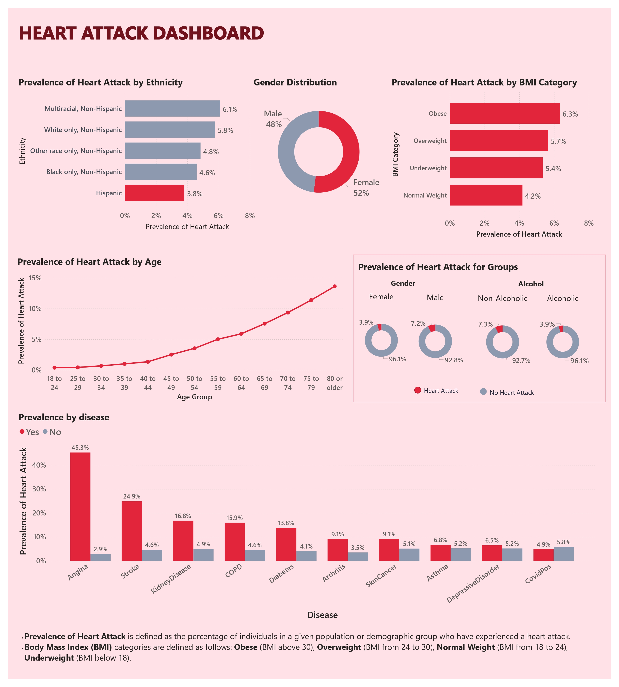

### Dashboard insights
1. **Prevalence by Ethnicity**: The data shows that the prevalence of heart attacks is highest among the Multiracial, Non-Hispanic population (6.1%), followed by White only, Non-Hispanic (5.8%), Other race only, Non-Hispanic (4.8%), Black only, Non-Hispanic (4.6%), and Hispanic (3.8%) populations.

2. **Gender Distribution**: There is a relatively even split between males (52%) and females (48%) in the data, indicating that heart attacks affect both genders significantly.

3. **Prevalence by BMI Category**: The prevalence of heart attacks is highest among individuals with obesity (6.3%), followed by overweight (5.7%), underweight (5.4%), and normal weight (4.2%) individuals, suggesting a strong correlation between higher BMI and increased risk of heart attacks.

4. **Prevalence by Age**: The prevalence of heart attacks increases significantly with age, with the highest rates observed in the 80 or older age group, indicating that age is a major risk factor for heart attacks.

5. **Comorbidities**: The data shows a high prevalence of heart attacks among individuals with certain comorbidities, such as angina (45.3%), stroke (24.9%), kidney disease (16.8%), COPD (15.9%), and diabetes (13.8%), highlighting the importance of managing these conditions to reduce the risk of heart attacks.

6. **Alcohol Consumption**: The data suggests that non-alcoholic individuals have a slightly higher prevalence of heart attacks (7.3%) compared to alcoholic individuals (3.9%), which may be counterintuitive and warrant further investigation or explanation.